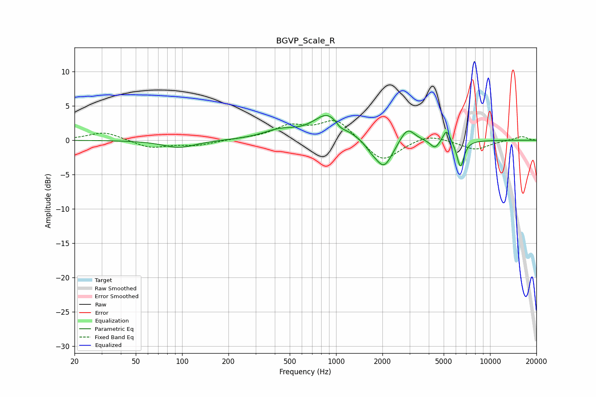

# BGVP_Scale_R
See [usage instructions](https://github.com/jaakkopasanen/AutoEq#usage) for more options and info.

### Parametric EQs
Apply preamp of -3.7 dB when using parametric equalizer.

|   # | Type    |   Fc (Hz) |    Q |   Gain (dB) |
|-----|---------|-----------|------|-------------|
|   1 | Peaking |        96 | 1.34 |        -1.1 |
|   2 | Peaking |       430 | 1.28 |         1.2 |
|   3 | Peaking |       891 | 1.48 |         3.7 |
|   4 | Peaking |      1068 | 4.27 |        -0.8 |
|   5 | Peaking |      1691 | 3.62 |        -0.7 |
|   6 | Peaking |      2047 | 2.47 |        -4.1 |
|   7 | Peaking |      2902 | 3    |         2.2 |
|   8 | Peaking |      4384 | 4.72 |        -1.2 |
|   9 | Peaking |      5219 | 6    |         1.9 |
|  10 | Peaking |      6421 | 5.92 |        -3.9 |

### Fixed Band EQs
When using fixed band (also called graphic) equalizer, apply preamp of **-3.0 dB** (if available) and set gains manually with these parameters.

|   # | Type    |   Fc (Hz) |    Q |   Gain (dB) |
|-----|---------|-----------|------|-------------|
|   1 | Peaking |        31 | 1.41 |         1.2 |
|   2 | Peaking |        62 | 1.41 |        -1.1 |
|   3 | Peaking |       125 | 1.41 |        -0.7 |
|   4 | Peaking |       250 | 1.41 |         0.2 |
|   5 | Peaking |       500 | 1.41 |         1.9 |
|   6 | Peaking |      1000 | 1.41 |         3   |
|   7 | Peaking |      2000 | 1.41 |        -3.3 |
|   8 | Peaking |      4000 | 1.41 |         1   |
|   9 | Peaking |      8000 | 1.41 |        -1.4 |
|  10 | Peaking |     16000 | 1.41 |         0.6 |

### Graphs

