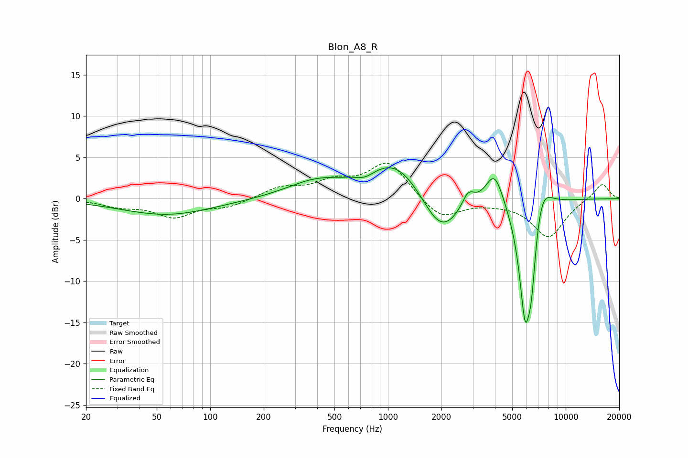

# Blon_A8_R
See [usage instructions](https://github.com/jaakkopasanen/AutoEq#usage) for more options and info.

### Parametric EQs
Apply preamp of -3.8 dB when using parametric equalizer.

|   # | Type    |   Fc (Hz) |    Q |   Gain (dB) |
|-----|---------|-----------|------|-------------|
|   1 | Peaking |        57 | 0.54 |        -2   |
|   2 | Peaking |       390 | 0.86 |         1.9 |
|   3 | Peaking |       746 | 2.88 |        -0.7 |
|   4 | Peaking |      1115 | 0.87 |         4.9 |
|   5 | Peaking |      1986 | 1.27 |        -5.4 |
|   6 | Peaking |      2826 | 3.93 |         2   |
|   7 | Peaking |      3975 | 2.75 |         4.2 |
|   8 | Peaking |      5908 | 3.7  |       -14.2 |
|   9 | Peaking |      6416 | 5.9  |        -5.8 |
|  10 | Peaking |      7312 | 2.54 |         3.6 |

### Fixed Band EQs
When using fixed band (also called graphic) equalizer, apply preamp of **-4.4 dB** (if available) and set gains manually with these parameters.

|   # | Type    |   Fc (Hz) |    Q |   Gain (dB) |
|-----|---------|-----------|------|-------------|
|   1 | Peaking |        31 | 1.41 |        -0.8 |
|   2 | Peaking |        62 | 1.41 |        -2.1 |
|   3 | Peaking |       125 | 1.41 |        -0.9 |
|   4 | Peaking |       250 | 1.41 |         1.3 |
|   5 | Peaking |       500 | 1.41 |         1.8 |
|   6 | Peaking |      1000 | 1.41 |         4.4 |
|   7 | Peaking |      2000 | 1.41 |        -2.6 |
|   8 | Peaking |      4000 | 1.41 |        -0.3 |
|   9 | Peaking |      8000 | 1.41 |        -4.6 |
|  10 | Peaking |     16000 | 1.41 |         1.9 |

### Graphs

