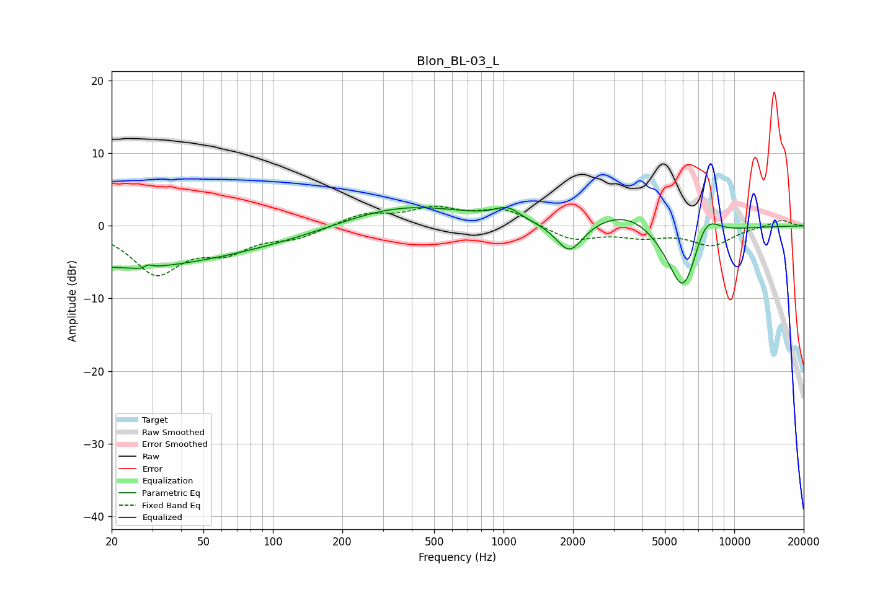

# Blon_BL-03_L
See [usage instructions](https://github.com/jaakkopasanen/AutoEq#usage) for more options and info.

### Parametric EQs
Apply preamp of -2.6 dB when using parametric equalizer.

|   # | Type    |   Fc (Hz) |    Q |   Gain (dB) |
|-----|---------|-----------|------|-------------|
|   1 | Peaking |        20 | 0.34 |        -5.3 |
|   2 | Peaking |        28 | 5.24 |        -2.3 |
|   3 | Peaking |        28 | 5.91 |         2.5 |
|   4 | Peaking |       103 | 0.37 |        -2   |
|   5 | Peaking |       350 | 0.49 |         3.4 |
|   6 | Peaking |      1038 | 2.55 |         1.6 |
|   7 | Peaking |      1931 | 2.37 |        -4.4 |
|   8 | Peaking |      3469 | 0.97 |         2.7 |
|   9 | Peaking |      6022 | 1.86 |       -10.8 |
|  10 | Peaking |      7497 | 2.24 |         4.6 |

### Fixed Band EQs
When using fixed band (also called graphic) equalizer, apply preamp of **-2.8 dB** (if available) and set gains manually with these parameters.

|   # | Type    |   Fc (Hz) |    Q |   Gain (dB) |
|-----|---------|-----------|------|-------------|
|   1 | Peaking |        31 | 1.41 |        -6.3 |
|   2 | Peaking |        62 | 1.41 |        -2.9 |
|   3 | Peaking |       125 | 1.41 |        -1.5 |
|   4 | Peaking |       250 | 1.41 |         1.6 |
|   5 | Peaking |       500 | 1.41 |         2.2 |
|   6 | Peaking |      1000 | 1.41 |         2.2 |
|   7 | Peaking |      2000 | 1.41 |        -2   |
|   8 | Peaking |      4000 | 1.41 |        -1.2 |
|   9 | Peaking |      8000 | 1.41 |        -2.6 |
|  10 | Peaking |     16000 | 1.41 |         0.9 |

### Graphs

