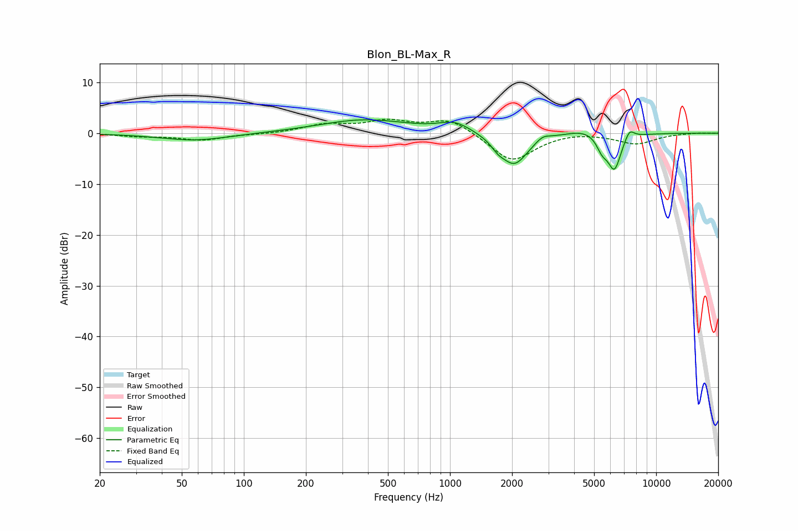

# Blon_BL-Max_R
See [usage instructions](https://github.com/jaakkopasanen/AutoEq#usage) for more options and info.

### Parametric EQs
Apply preamp of -2.7 dB when using parametric equalizer.

|   # | Type    |   Fc (Hz) |    Q |   Gain (dB) |
|-----|---------|-----------|------|-------------|
|   1 | Peaking |        58 | 0.84 |        -1.5 |
|   2 | Peaking |       385 | 0.65 |         2.6 |
|   3 | Peaking |      1058 | 1.82 |         2   |
|   4 | Peaking |      1711 | 4.41 |        -1.2 |
|   5 | Peaking |      2052 | 2.11 |        -6.3 |
|   6 | Peaking |      2817 | 4.21 |         1   |
|   7 | Peaking |      4686 | 1.51 |         1.3 |
|   8 | Peaking |      5467 | 4.86 |        -2.7 |
|   9 | Peaking |      6276 | 4.09 |        -7.1 |
|  10 | Peaking |      7421 | 5.77 |         2   |

### Fixed Band EQs
When using fixed band (also called graphic) equalizer, apply preamp of **-2.8 dB** (if available) and set gains manually with these parameters.

|   # | Type    |   Fc (Hz) |    Q |   Gain (dB) |
|-----|---------|-----------|------|-------------|
|   1 | Peaking |        31 | 1.41 |        -0.5 |
|   2 | Peaking |        62 | 1.41 |        -1.3 |
|   3 | Peaking |       125 | 1.41 |        -0.2 |
|   4 | Peaking |       250 | 1.41 |         1.6 |
|   5 | Peaking |       500 | 1.41 |         2.1 |
|   6 | Peaking |      1000 | 1.41 |         2.9 |
|   7 | Peaking |      2000 | 1.41 |        -5.7 |
|   8 | Peaking |      4000 | 1.41 |         0.4 |
|   9 | Peaking |      8000 | 1.41 |        -2   |
|  10 | Peaking |     16000 | 1.41 |         0.1 |

### Graphs

