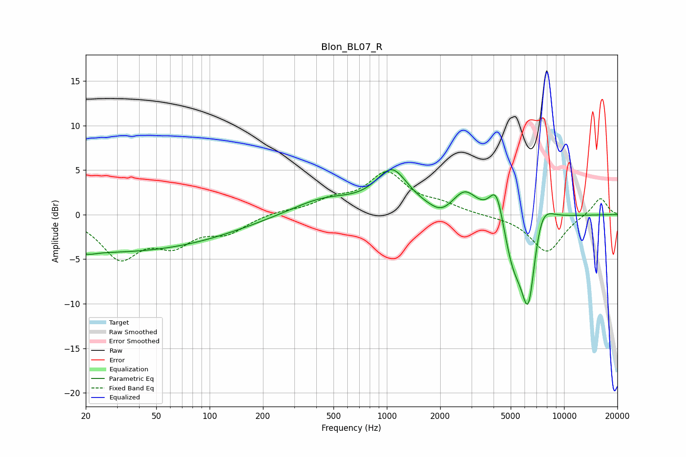

# Blon_BL07_R
See [usage instructions](https://github.com/jaakkopasanen/AutoEq#usage) for more options and info.

### Parametric EQs
Apply preamp of -5.1 dB when using parametric equalizer.

|   # | Type    |   Fc (Hz) |    Q |   Gain (dB) |
|-----|---------|-----------|------|-------------|
|   1 | Peaking |        21 | 3.57 |        -0.3 |
|   2 | Peaking |        25 | 0.18 |        -4.2 |
|   3 | Peaking |       441 | 0.76 |         1.8 |
|   4 | Peaking |      1070 | 1.55 |         4.6 |
|   5 | Peaking |      2024 | 2.3  |        -1   |
|   6 | Peaking |      2761 | 2.06 |         2.6 |
|   7 | Peaking |      4167 | 3.36 |         4.3 |
|   8 | Peaking |      5142 | 2.37 |        -4.8 |
|   9 | Peaking |      6297 | 3.04 |       -10.8 |
|  10 | Peaking |      7336 | 2.18 |         4   |

### Fixed Band EQs
When using fixed band (also called graphic) equalizer, apply preamp of **-4.9 dB** (if available) and set gains manually with these parameters.

|   # | Type    |   Fc (Hz) |    Q |   Gain (dB) |
|-----|---------|-----------|------|-------------|
|   1 | Peaking |        31 | 1.41 |        -4.6 |
|   2 | Peaking |        62 | 1.41 |        -2.9 |
|   3 | Peaking |       125 | 1.41 |        -1.8 |
|   4 | Peaking |       250 | 1.41 |         0.4 |
|   5 | Peaking |       500 | 1.41 |         1.4 |
|   6 | Peaking |      1000 | 1.41 |         4.4 |
|   7 | Peaking |      2000 | 1.41 |         1   |
|   8 | Peaking |      4000 | 1.41 |        -0.1 |
|   9 | Peaking |      8000 | 1.41 |        -4.2 |
|  10 | Peaking |     16000 | 1.41 |         2   |

### Graphs

