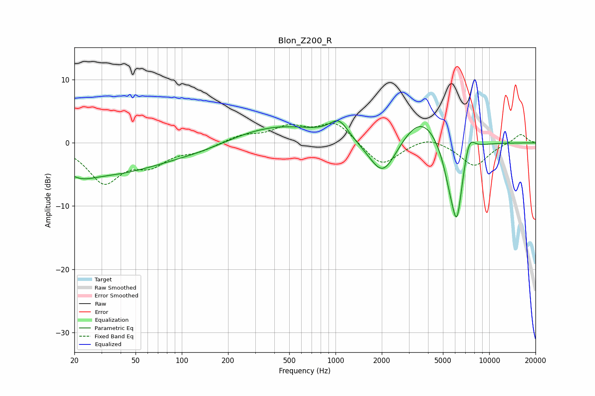

# Blon_Z200_R
See [usage instructions](https://github.com/jaakkopasanen/AutoEq#usage) for more options and info.

### Parametric EQs
Apply preamp of -3.6 dB when using parametric equalizer.

|   # | Type    |   Fc (Hz) |    Q |   Gain (dB) |
|-----|---------|-----------|------|-------------|
|   1 | Peaking |        22 | 1.76 |        -1.1 |
|   2 | Peaking |        31 | 0.36 |        -4.8 |
|   3 | Peaking |       138 | 0.69 |        -0.8 |
|   4 | Peaking |       419 | 0.47 |         2.8 |
|   5 | Peaking |      1054 | 2.31 |         2.9 |
|   6 | Peaking |      2032 | 1.54 |        -6.2 |
|   7 | Peaking |      3595 | 1.12 |         4.9 |
|   8 | Peaking |      5550 | 2.84 |        -3.9 |
|   9 | Peaking |      6166 | 3.45 |       -11.4 |
|  10 | Peaking |      7401 | 3.79 |         3.3 |

### Fixed Band EQs
When using fixed band (also called graphic) equalizer, apply preamp of **-3.2 dB** (if available) and set gains manually with these parameters.

|   # | Type    |   Fc (Hz) |    Q |   Gain (dB) |
|-----|---------|-----------|------|-------------|
|   1 | Peaking |        31 | 1.41 |        -6   |
|   2 | Peaking |        62 | 1.41 |        -2.9 |
|   3 | Peaking |       125 | 1.41 |        -1.1 |
|   4 | Peaking |       250 | 1.41 |         1.1 |
|   5 | Peaking |       500 | 1.41 |         2.3 |
|   6 | Peaking |      1000 | 1.41 |         3.2 |
|   7 | Peaking |      2000 | 1.41 |        -3.8 |
|   8 | Peaking |      4000 | 1.41 |         1.2 |
|   9 | Peaking |      8000 | 1.41 |        -3.7 |
|  10 | Peaking |     16000 | 1.41 |         1.5 |

### Graphs

