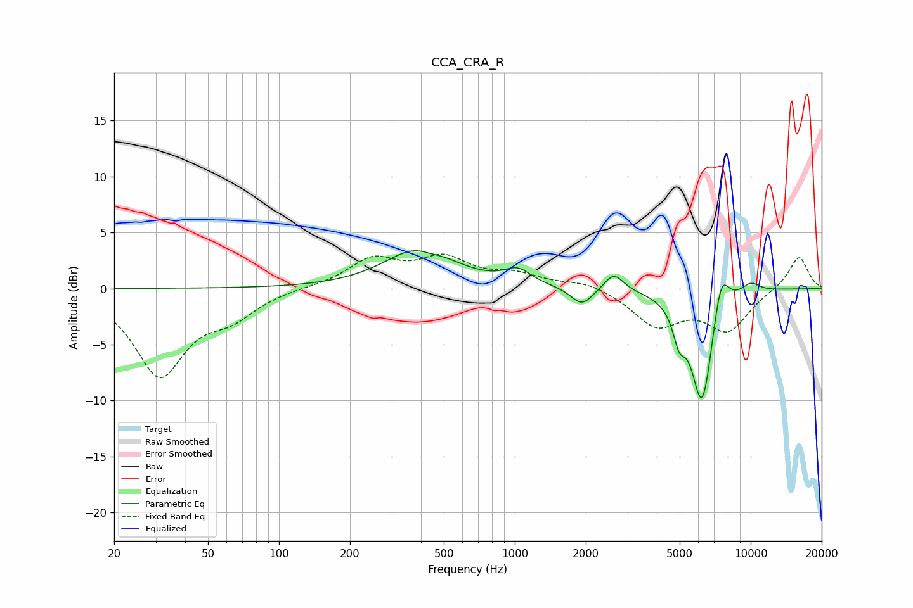

# CCA_CRA_R
See [usage instructions](https://github.com/jaakkopasanen/AutoEq#usage) for more options and info.

### Parametric EQs
Apply preamp of -3.5 dB when using parametric equalizer.

|   # | Type    |   Fc (Hz) |    Q |   Gain (dB) |
|-----|---------|-----------|------|-------------|
|   1 | Peaking |       399 | 0.98 |         3.7 |
|   2 | Peaking |       438 | 2.71 |        -0.4 |
|   3 | Peaking |      1029 | 2.49 |         1.3 |
|   4 | Peaking |      1924 | 3.03 |        -1.6 |
|   5 | Peaking |      2628 | 3.48 |         1.6 |
|   6 | Peaking |      4976 | 5.28 |        -2.7 |
|   7 | Peaking |      6187 | 2.93 |        -9.7 |
|   8 | Peaking |      6481 | 4.63 |        -0.8 |
|   9 | Peaking |      7494 | 4.09 |         3.7 |
|  10 | Peaking |     10000 | 3.04 |         0.9 |

### Fixed Band EQs
When using fixed band (also called graphic) equalizer, apply preamp of **-3.2 dB** (if available) and set gains manually with these parameters.

|   # | Type    |   Fc (Hz) |    Q |   Gain (dB) |
|-----|---------|-----------|------|-------------|
|   1 | Peaking |        31 | 1.41 |        -7.6 |
|   2 | Peaking |        62 | 1.41 |        -2   |
|   3 | Peaking |       125 | 1.41 |         0.1 |
|   4 | Peaking |       250 | 1.41 |         2.5 |
|   5 | Peaking |       500 | 1.41 |         2.4 |
|   6 | Peaking |      1000 | 1.41 |         1.1 |
|   7 | Peaking |      2000 | 1.41 |         0.7 |
|   8 | Peaking |      4000 | 1.41 |        -3.2 |
|   9 | Peaking |      8000 | 1.41 |        -3.6 |
|  10 | Peaking |     16000 | 1.41 |         3   |

### Graphs

