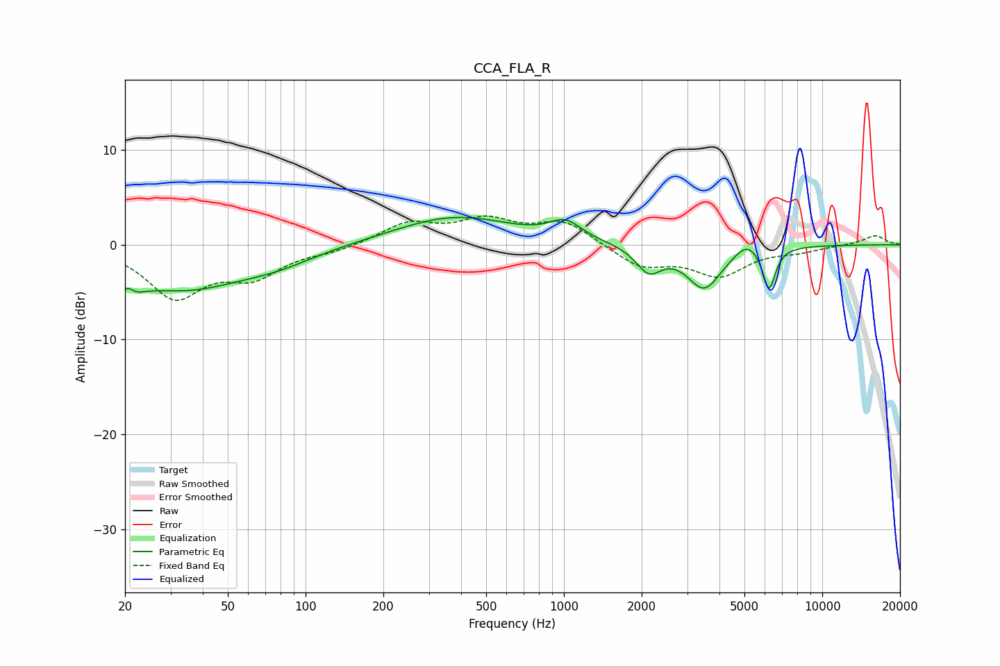

# CCA_FLA_R
See [usage instructions](https://github.com/jaakkopasanen/AutoEq#usage) for more options and info.

### Parametric EQs
Apply preamp of -3.0 dB when using parametric equalizer.

|   # | Type    |   Fc (Hz) |    Q |   Gain (dB) |
|-----|---------|-----------|------|-------------|
|   1 | Peaking |        20 | 3.38 |        -4.6 |
|   2 | Peaking |        20 | 5.24 |         3.2 |
|   3 | Peaking |        34 | 0.58 |        -4.5 |
|   4 | Peaking |        78 | 0.97 |        -1.1 |
|   5 | Peaking |       378 | 0.62 |         3   |
|   6 | Peaking |      1014 | 2.29 |         1.9 |
|   7 | Peaking |      2129 | 2.88 |        -2.7 |
|   8 | Peaking |      3493 | 2.09 |        -4.5 |
|   9 | Peaking |      5111 | 3.15 |         1.3 |
|  10 | Peaking |      6226 | 5.61 |        -4.5 |

### Fixed Band EQs
When using fixed band (also called graphic) equalizer, apply preamp of **-3.1 dB** (if available) and set gains manually with these parameters.

|   # | Type    |   Fc (Hz) |    Q |   Gain (dB) |
|-----|---------|-----------|------|-------------|
|   1 | Peaking |        31 | 1.41 |        -5.3 |
|   2 | Peaking |        62 | 1.41 |        -3   |
|   3 | Peaking |       125 | 1.41 |        -0.6 |
|   4 | Peaking |       250 | 1.41 |         2.2 |
|   5 | Peaking |       500 | 1.41 |         2.4 |
|   6 | Peaking |      1000 | 1.41 |         2.4 |
|   7 | Peaking |      2000 | 1.41 |        -2.3 |
|   8 | Peaking |      4000 | 1.41 |        -3.1 |
|   9 | Peaking |      8000 | 1.41 |        -0.6 |
|  10 | Peaking |     16000 | 1.41 |         1   |

### Graphs

