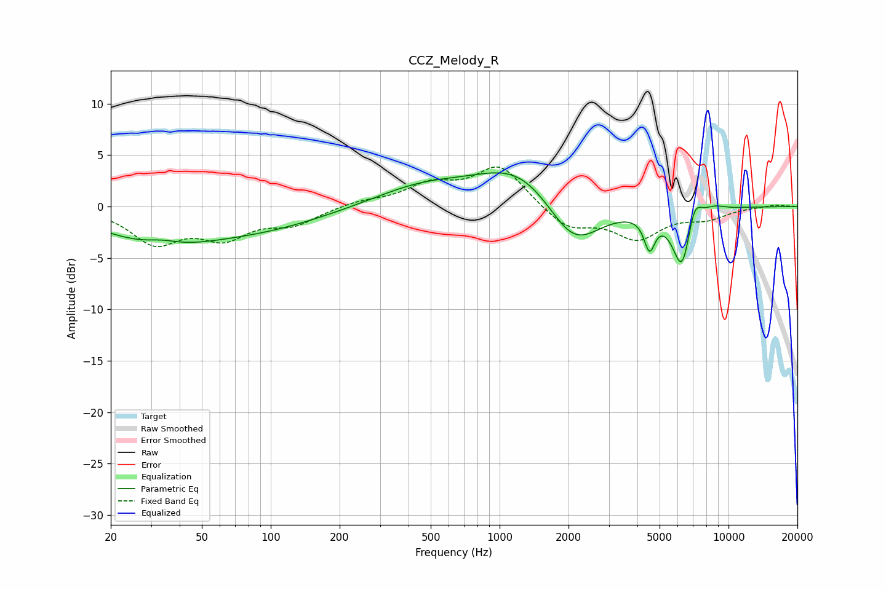

# CCZ_Melody_R
See [usage instructions](https://github.com/jaakkopasanen/AutoEq#usage) for more options and info.

### Parametric EQs
Apply preamp of -3.4 dB when using parametric equalizer.

|   # | Type    |   Fc (Hz) |    Q |   Gain (dB) |
|-----|---------|-----------|------|-------------|
|   1 | Peaking |        32 | 0.58 |        -3.2 |
|   2 | Peaking |        34 | 1.9  |         0.6 |
|   3 | Peaking |        94 | 0.49 |        -1.8 |
|   4 | Peaking |       458 | 0.67 |         1.9 |
|   5 | Peaking |      1230 | 0.77 |         4   |
|   6 | Peaking |      2101 | 1.18 |        -5   |
|   7 | Peaking |      4520 | 5.87 |        -3.1 |
|   8 | Peaking |      6288 | 3.22 |        -6.3 |
|   9 | Peaking |      7059 | 4.13 |         2.9 |
|  10 | Peaking |      8646 | 2.79 |         0.5 |

### Fixed Band EQs
When using fixed band (also called graphic) equalizer, apply preamp of **-3.9 dB** (if available) and set gains manually with these parameters.

|   # | Type    |   Fc (Hz) |    Q |   Gain (dB) |
|-----|---------|-----------|------|-------------|
|   1 | Peaking |        31 | 1.41 |        -3.4 |
|   2 | Peaking |        62 | 1.41 |        -2.7 |
|   3 | Peaking |       125 | 1.41 |        -1.6 |
|   4 | Peaking |       250 | 1.41 |         0.5 |
|   5 | Peaking |       500 | 1.41 |         1.9 |
|   6 | Peaking |      1000 | 1.41 |         3.9 |
|   7 | Peaking |      2000 | 1.41 |        -2.2 |
|   8 | Peaking |      4000 | 1.41 |        -2.9 |
|   9 | Peaking |      8000 | 1.41 |        -1   |
|  10 | Peaking |     16000 | 1.41 |         0.2 |

### Graphs

