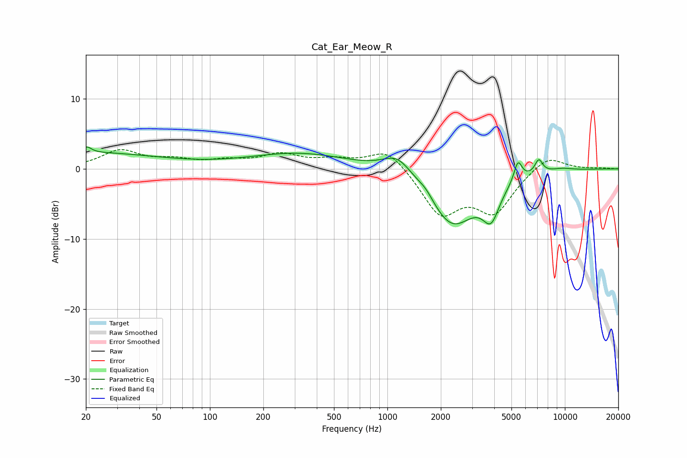

# Cat_Ear_Meow_R
See [usage instructions](https://github.com/jaakkopasanen/AutoEq#usage) for more options and info.

### Parametric EQs
Apply preamp of -3.2 dB when using parametric equalizer.

|   # | Type    |   Fc (Hz) |    Q |   Gain (dB) |
|-----|---------|-----------|------|-------------|
|   1 | Peaking |        20 | 0.33 |         2.3 |
|   2 | Peaking |        20 | 5.81 |         0.8 |
|   3 | Peaking |       320 | 0.5  |         2.2 |
|   4 | Peaking |      1149 | 1.63 |         3   |
|   5 | Peaking |      1645 | 3.15 |         1   |
|   6 | Peaking |      2312 | 1.02 |        -8.1 |
|   7 | Peaking |      3839 | 2.99 |        -4.5 |
|   8 | Peaking |      5443 | 6    |         2.9 |
|   9 | Peaking |      7126 | 6    |         2   |
|  10 | Peaking |      9538 | 1.91 |         0.4 |

### Fixed Band EQs
When using fixed band (also called graphic) equalizer, apply preamp of **-2.8 dB** (if available) and set gains manually with these parameters.

|   # | Type    |   Fc (Hz) |    Q |   Gain (dB) |
|-----|---------|-----------|------|-------------|
|   1 | Peaking |        31 | 1.41 |         2.5 |
|   2 | Peaking |        62 | 1.41 |         1   |
|   3 | Peaking |       125 | 1.41 |         0.9 |
|   4 | Peaking |       250 | 1.41 |         1.9 |
|   5 | Peaking |       500 | 1.41 |         1.1 |
|   6 | Peaking |      1000 | 1.41 |         3.1 |
|   7 | Peaking |      2000 | 1.41 |        -6.3 |
|   8 | Peaking |      4000 | 1.41 |        -5.8 |
|   9 | Peaking |      8000 | 1.41 |         2.1 |
|  10 | Peaking |     16000 | 1.41 |         0.1 |

### Graphs

