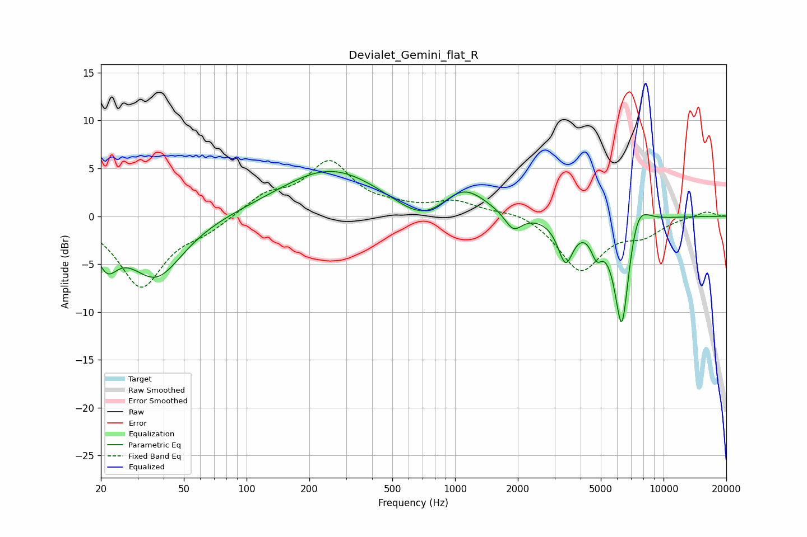

# Devialet_Gemini_flat_R
See [usage instructions](https://github.com/jaakkopasanen/AutoEq#usage) for more options and info.

### Parametric EQs
Apply preamp of -4.8 dB when using parametric equalizer.

|   # | Type    |   Fc (Hz) |    Q |   Gain (dB) |
|-----|---------|-----------|------|-------------|
|   1 | Peaking |        21 | 2.79 |        -3.5 |
|   2 | Peaking |        37 | 1.08 |        -6.3 |
|   3 | Peaking |       253 | 0.57 |         5   |
|   4 | Peaking |       708 | 1.12 |        -2.3 |
|   5 | Peaking |      1098 | 1.31 |         3.1 |
|   6 | Peaking |      1903 | 3.47 |        -1.9 |
|   7 | Peaking |      3388 | 3.85 |        -4.4 |
|   8 | Peaking |      4773 | 5.14 |        -2.4 |
|   9 | Peaking |      6314 | 3.59 |       -12.5 |
|  10 | Peaking |      7462 | 2.51 |         3.6 |

### Fixed Band EQs
When using fixed band (also called graphic) equalizer, apply preamp of **-5.9 dB** (if available) and set gains manually with these parameters.

|   # | Type    |   Fc (Hz) |    Q |   Gain (dB) |
|-----|---------|-----------|------|-------------|
|   1 | Peaking |        31 | 1.41 |        -7.3 |
|   2 | Peaking |        62 | 1.41 |        -1.2 |
|   3 | Peaking |       125 | 1.41 |         2   |
|   4 | Peaking |       250 | 1.41 |         5.4 |
|   5 | Peaking |       500 | 1.41 |         0.6 |
|   6 | Peaking |      1000 | 1.41 |         1.4 |
|   7 | Peaking |      2000 | 1.41 |         0.7 |
|   8 | Peaking |      4000 | 1.41 |        -5.6 |
|   9 | Peaking |      8000 | 1.41 |        -1.6 |
|  10 | Peaking |     16000 | 1.41 |         0.6 |

### Graphs

