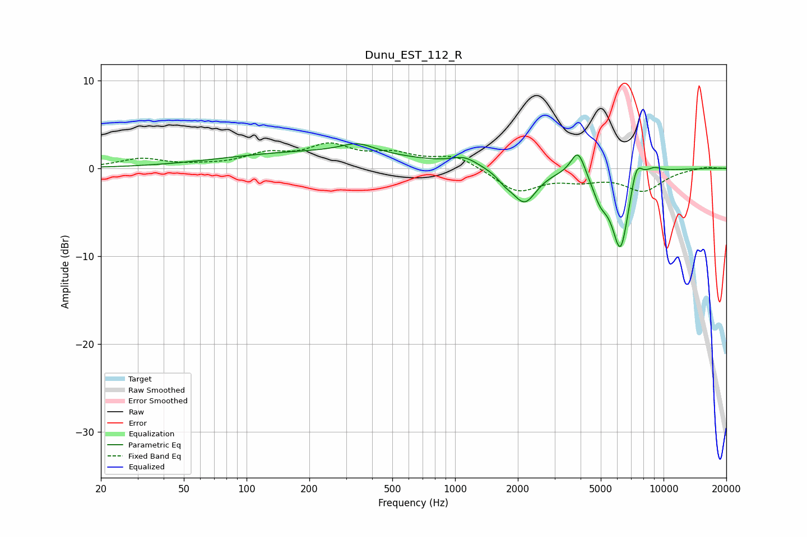

# Dunu_EST_112_R
See [usage instructions](https://github.com/jaakkopasanen/AutoEq#usage) for more options and info.

### Parametric EQs
Apply preamp of -2.9 dB when using parametric equalizer.

|   # | Type    |   Fc (Hz) |    Q |   Gain (dB) |
|-----|---------|-----------|------|-------------|
|   1 | Peaking |       219 | 0.31 |         1.8 |
|   2 | Peaking |       342 | 1.78 |         1.1 |
|   3 | Peaking |      1112 | 2.3  |         1   |
|   4 | Peaking |      1733 | 3.9  |        -0.7 |
|   5 | Peaking |      2152 | 2.41 |        -3.8 |
|   6 | Peaking |      3890 | 4.09 |         3   |
|   7 | Peaking |      4973 | 3.61 |        -2.4 |
|   8 | Peaking |      6218 | 3.23 |        -9.1 |
|   9 | Peaking |      7399 | 4.68 |         3   |
|  10 | Peaking |      8956 | 3.21 |         0.7 |

### Fixed Band EQs
When using fixed band (also called graphic) equalizer, apply preamp of **-3.0 dB** (if available) and set gains manually with these parameters.

|   # | Type    |   Fc (Hz) |    Q |   Gain (dB) |
|-----|---------|-----------|------|-------------|
|   1 | Peaking |        31 | 1.41 |         1   |
|   2 | Peaking |        62 | 1.41 |         0.2 |
|   3 | Peaking |       125 | 1.41 |         1.4 |
|   4 | Peaking |       250 | 1.41 |         2.3 |
|   5 | Peaking |       500 | 1.41 |         1.4 |
|   6 | Peaking |      1000 | 1.41 |         1.4 |
|   7 | Peaking |      2000 | 1.41 |        -2.6 |
|   8 | Peaking |      4000 | 1.41 |        -1   |
|   9 | Peaking |      8000 | 1.41 |        -2.4 |
|  10 | Peaking |     16000 | 1.41 |         0.2 |

### Graphs

