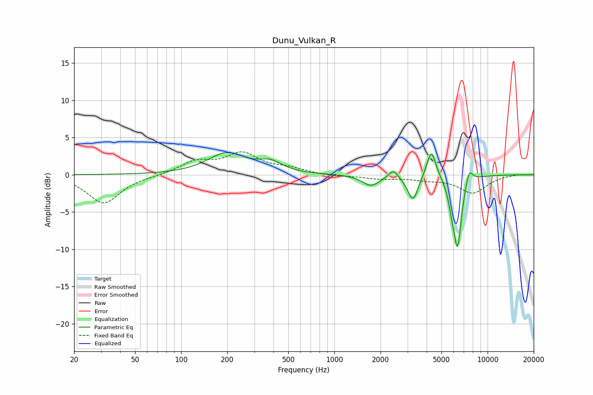

# Dunu_Vulkan_R
See [usage instructions](https://github.com/jaakkopasanen/AutoEq#usage) for more options and info.

### Parametric EQs
Apply preamp of -3.1 dB when using parametric equalizer.

|   # | Type    |   Fc (Hz) |    Q |   Gain (dB) |
|-----|---------|-----------|------|-------------|
|   1 | Peaking |       198 | 1.13 |         2.8 |
|   2 | Peaking |       383 | 1.91 |         1.3 |
|   3 | Peaking |      1733 | 2.52 |        -1.4 |
|   4 | Peaking |      2425 | 4.84 |         1.2 |
|   5 | Peaking |      3151 | 3.55 |        -0.6 |
|   6 | Peaking |      3272 | 4.41 |        -2.8 |
|   7 | Peaking |      4296 | 4.71 |         3.8 |
|   8 | Peaking |      5838 | 6    |        -2.1 |
|   9 | Peaking |      6373 | 5.18 |        -9.2 |
|  10 | Peaking |      7582 | 5.89 |         2   |

### Fixed Band EQs
When using fixed band (also called graphic) equalizer, apply preamp of **-3.2 dB** (if available) and set gains manually with these parameters.

|   # | Type    |   Fc (Hz) |    Q |   Gain (dB) |
|-----|---------|-----------|------|-------------|
|   1 | Peaking |        31 | 1.41 |        -3.8 |
|   2 | Peaking |        62 | 1.41 |        -0.1 |
|   3 | Peaking |       125 | 1.41 |         1.7 |
|   4 | Peaking |       250 | 1.41 |         2.7 |
|   5 | Peaking |       500 | 1.41 |         0.7 |
|   6 | Peaking |      1000 | 1.41 |        -0.2 |
|   7 | Peaking |      2000 | 1.41 |        -0.5 |
|   8 | Peaking |      4000 | 1.41 |        -0.5 |
|   9 | Peaking |      8000 | 1.41 |        -2.4 |
|  10 | Peaking |     16000 | 1.41 |         0.1 |

### Graphs

