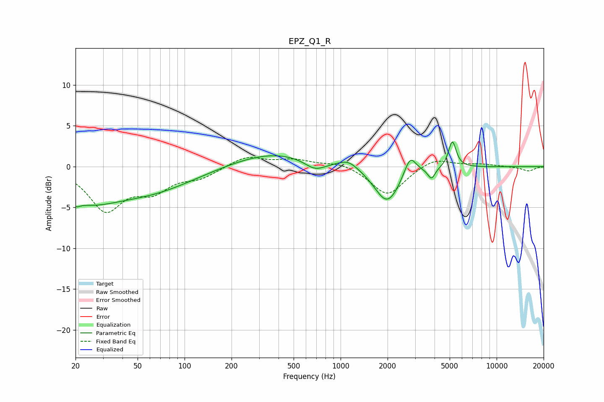

# EPZ_Q1_R
See [usage instructions](https://github.com/jaakkopasanen/AutoEq#usage) for more options and info.

### Parametric EQs
Apply preamp of -3.1 dB when using parametric equalizer.

|   # | Type    |   Fc (Hz) |    Q |   Gain (dB) |
|-----|---------|-----------|------|-------------|
|   1 | Peaking |        20 | 5.77 |        -0.6 |
|   2 | Peaking |        23 | 0.67 |        -3.5 |
|   3 | Peaking |        63 | 0.5  |        -2.6 |
|   4 | Peaking |       369 | 0.52 |         1.8 |
|   5 | Peaking |       686 | 2.05 |        -1.3 |
|   6 | Peaking |      1122 | 2.26 |         1   |
|   7 | Peaking |      1990 | 1.72 |        -4.6 |
|   8 | Peaking |      2788 | 3.72 |         2.5 |
|   9 | Peaking |      3822 | 5.99 |        -1.4 |
|  10 | Peaking |      5201 | 5.72 |         3.3 |

### Fixed Band EQs
When using fixed band (also called graphic) equalizer, apply preamp of **-1.2 dB** (if available) and set gains manually with these parameters.

|   # | Type    |   Fc (Hz) |    Q |   Gain (dB) |
|-----|---------|-----------|------|-------------|
|   1 | Peaking |        31 | 1.41 |        -5.1 |
|   2 | Peaking |        62 | 1.41 |        -2.5 |
|   3 | Peaking |       125 | 1.41 |        -1.2 |
|   4 | Peaking |       250 | 1.41 |         1.3 |
|   5 | Peaking |       500 | 1.41 |         0.8 |
|   6 | Peaking |      1000 | 1.41 |         0.6 |
|   7 | Peaking |      2000 | 1.41 |        -3.6 |
|   8 | Peaking |      4000 | 1.41 |         1.1 |
|   9 | Peaking |      8000 | 1.41 |         0.3 |
|  10 | Peaking |     16000 | 1.41 |        -0.5 |

### Graphs

