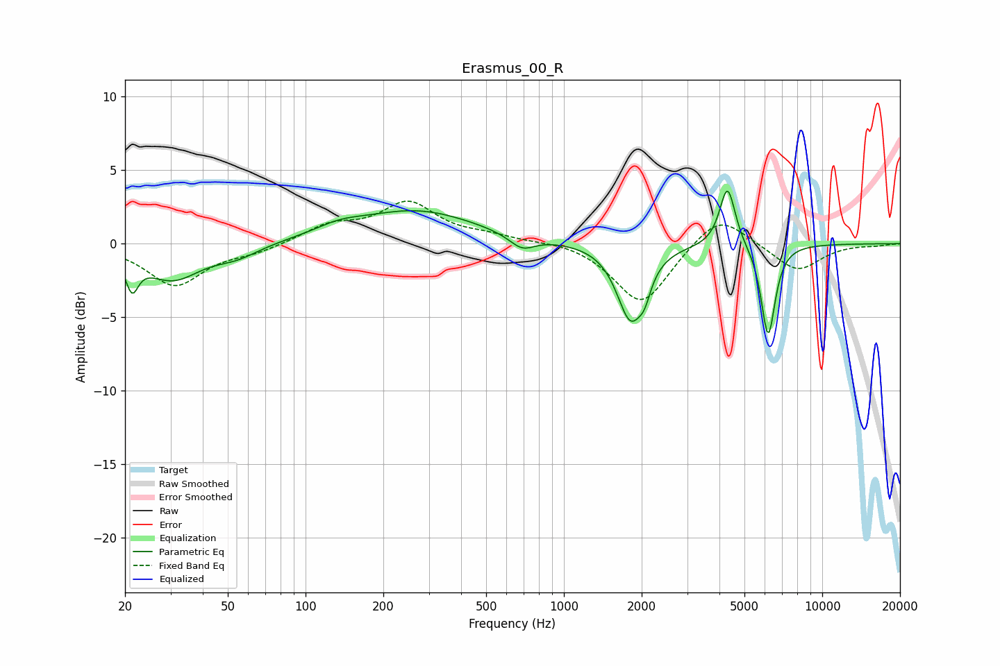

# Erasmus_00_R
See [usage instructions](https://github.com/jaakkopasanen/AutoEq#usage) for more options and info.

### Parametric EQs
Apply preamp of -3.7 dB when using parametric equalizer.

|   # | Type    |   Fc (Hz) |    Q |   Gain (dB) |
|-----|---------|-----------|------|-------------|
|   1 | Peaking |        21 | 5.98 |        -2.1 |
|   2 | Peaking |        30 | 1.3  |        -2.4 |
|   3 | Peaking |        54 | 1.63 |        -0.7 |
|   4 | Peaking |       134 | 1.52 |         0.6 |
|   5 | Peaking |       269 | 0.61 |         2.2 |
|   6 | Peaking |       689 | 2.84 |        -0.9 |
|   7 | Peaking |      1811 | 2.71 |        -5   |
|   8 | Peaking |      2054 | 6    |        -1.2 |
|   9 | Peaking |      4299 | 4.71 |         4.1 |
|  10 | Peaking |      6176 | 5.07 |        -6.3 |

### Fixed Band EQs
When using fixed band (also called graphic) equalizer, apply preamp of **-3.0 dB** (if available) and set gains manually with these parameters.

|   # | Type    |   Fc (Hz) |    Q |   Gain (dB) |
|-----|---------|-----------|------|-------------|
|   1 | Peaking |        31 | 1.41 |        -2.8 |
|   2 | Peaking |        62 | 1.41 |        -0.5 |
|   3 | Peaking |       125 | 1.41 |         1.2 |
|   4 | Peaking |       250 | 1.41 |         2.7 |
|   5 | Peaking |       500 | 1.41 |         0.4 |
|   6 | Peaking |      1000 | 1.41 |         0.2 |
|   7 | Peaking |      2000 | 1.41 |        -4.2 |
|   8 | Peaking |      4000 | 1.41 |         2.2 |
|   9 | Peaking |      8000 | 1.41 |        -1.9 |
|  10 | Peaking |     16000 | 1.41 |        -0.1 |

### Graphs

