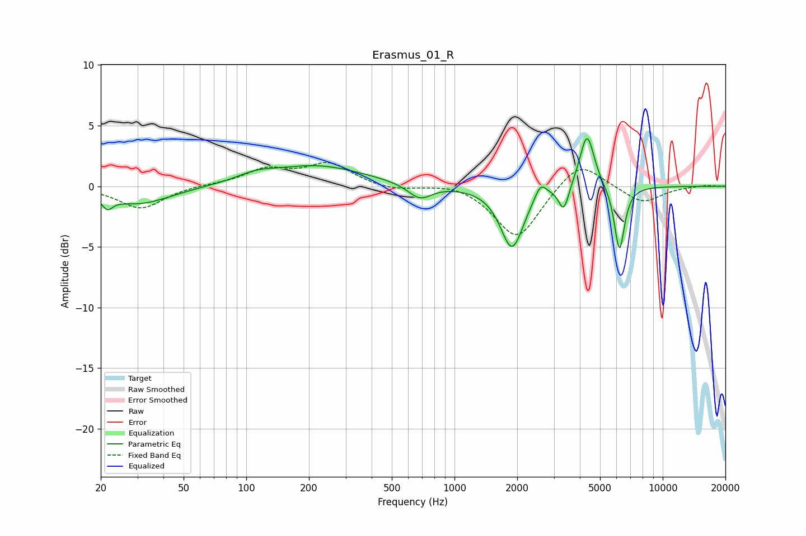

# Erasmus_01_R
See [usage instructions](https://github.com/jaakkopasanen/AutoEq#usage) for more options and info.

### Parametric EQs
Apply preamp of -4.0 dB when using parametric equalizer.

|   # | Type    |   Fc (Hz) |    Q |   Gain (dB) |
|-----|---------|-----------|------|-------------|
|   1 | Peaking |        22 | 5.76 |        -0.9 |
|   2 | Peaking |        30 | 0.9  |        -1.5 |
|   3 | Peaking |       111 | 1.58 |         0.5 |
|   4 | Peaking |       217 | 0.62 |         1.7 |
|   5 | Peaking |       682 | 2.48 |        -1.2 |
|   6 | Peaking |      1890 | 2.57 |        -5.1 |
|   7 | Peaking |      2590 | 5.05 |         1.2 |
|   8 | Peaking |      3348 | 5.91 |        -2.1 |
|   9 | Peaking |      4331 | 4.04 |         4.6 |
|  10 | Peaking |      6197 | 5.65 |        -5.4 |

### Fixed Band EQs
When using fixed band (also called graphic) equalizer, apply preamp of **-2.1 dB** (if available) and set gains manually with these parameters.

|   # | Type    |   Fc (Hz) |    Q |   Gain (dB) |
|-----|---------|-----------|------|-------------|
|   1 | Peaking |        31 | 1.41 |        -1.9 |
|   2 | Peaking |        62 | 1.41 |         0.1 |
|   3 | Peaking |       125 | 1.41 |         1.3 |
|   4 | Peaking |       250 | 1.41 |         1.8 |
|   5 | Peaking |       500 | 1.41 |        -0.4 |
|   6 | Peaking |      1000 | 1.41 |         0.4 |
|   7 | Peaking |      2000 | 1.41 |        -4.4 |
|   8 | Peaking |      4000 | 1.41 |         2.3 |
|   9 | Peaking |      8000 | 1.41 |        -1.4 |
|  10 | Peaking |     16000 | 1.41 |         0.1 |

### Graphs

