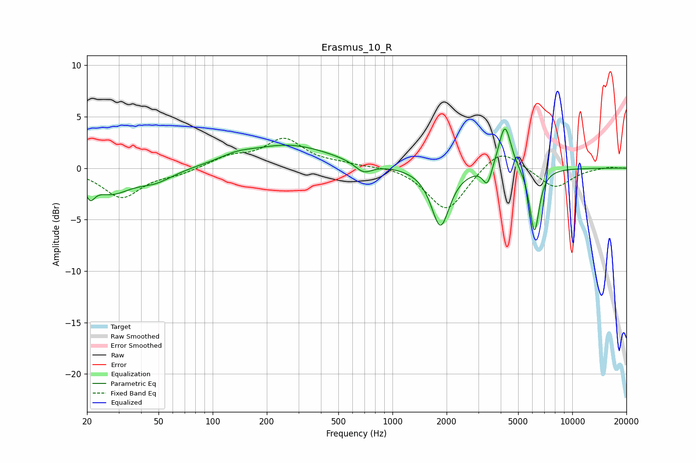

# Erasmus_10_R
See [usage instructions](https://github.com/jaakkopasanen/AutoEq#usage) for more options and info.

### Parametric EQs
Apply preamp of -3.9 dB when using parametric equalizer.

|   # | Type    |   Fc (Hz) |    Q |   Gain (dB) |
|-----|---------|-----------|------|-------------|
|   1 | Peaking |        21 | 5.35 |        -1.6 |
|   2 | Peaking |        27 | 1.33 |        -2.2 |
|   3 | Peaking |        48 | 1.37 |        -1.1 |
|   4 | Peaking |       135 | 1.59 |         0.5 |
|   5 | Peaking |       265 | 0.6  |         2.2 |
|   6 | Peaking |       691 | 2.95 |        -1   |
|   7 | Peaking |      1849 | 2.81 |        -5.7 |
|   8 | Peaking |      3371 | 6    |        -1.9 |
|   9 | Peaking |      4221 | 4.11 |         4.5 |
|  10 | Peaking |      6162 | 5.12 |        -6.3 |

### Fixed Band EQs
When using fixed band (also called graphic) equalizer, apply preamp of **-3.0 dB** (if available) and set gains manually with these parameters.

|   # | Type    |   Fc (Hz) |    Q |   Gain (dB) |
|-----|---------|-----------|------|-------------|
|   1 | Peaking |        31 | 1.41 |        -2.8 |
|   2 | Peaking |        62 | 1.41 |        -0.5 |
|   3 | Peaking |       125 | 1.41 |         1   |
|   4 | Peaking |       250 | 1.41 |         2.7 |
|   5 | Peaking |       500 | 1.41 |         0.3 |
|   6 | Peaking |      1000 | 1.41 |         0.3 |
|   7 | Peaking |      2000 | 1.41 |        -4.2 |
|   8 | Peaking |      4000 | 1.41 |         2.2 |
|   9 | Peaking |      8000 | 1.41 |        -2   |
|  10 | Peaking |     16000 | 1.41 |         0.1 |

### Graphs

