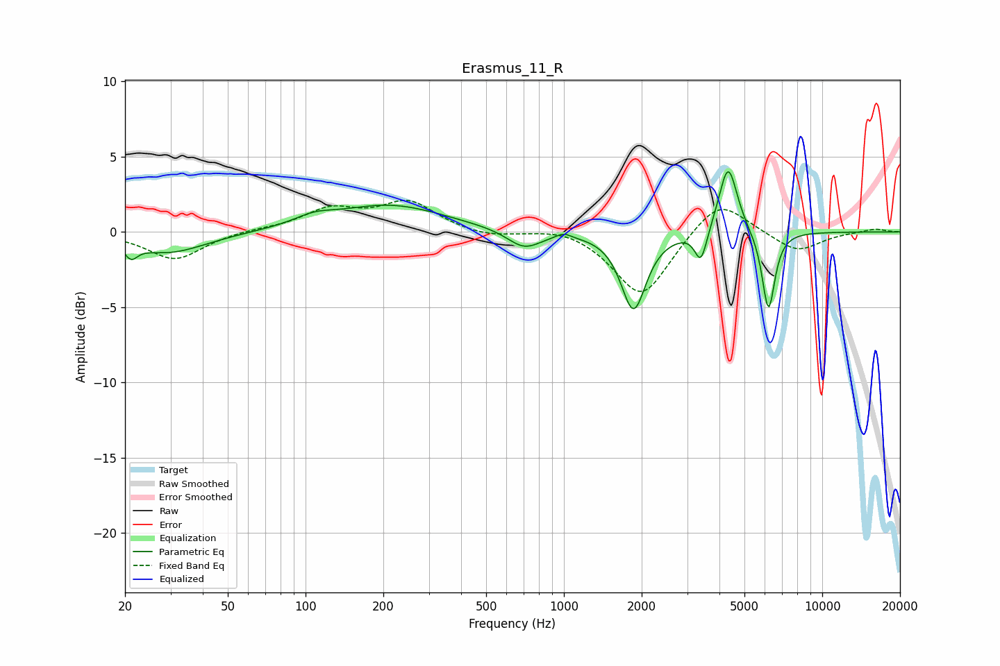

# Erasmus_11_R
See [usage instructions](https://github.com/jaakkopasanen/AutoEq#usage) for more options and info.

### Parametric EQs
Apply preamp of -4.1 dB when using parametric equalizer.

|   # | Type    |   Fc (Hz) |    Q |   Gain (dB) |
|-----|---------|-----------|------|-------------|
|   1 | Peaking |        21 | 5.85 |        -0.9 |
|   2 | Peaking |        29 | 0.96 |        -1.4 |
|   3 | Peaking |       108 | 1.88 |         0.5 |
|   4 | Peaking |       211 | 0.67 |         1.8 |
|   5 | Peaking |       702 | 2.15 |        -1.2 |
|   6 | Peaking |       997 | 5.1  |         0.3 |
|   7 | Peaking |      1860 | 2.97 |        -5.1 |
|   8 | Peaking |      3393 | 6    |        -2.2 |
|   9 | Peaking |      4323 | 3.94 |         4.6 |
|  10 | Peaking |      6194 | 5.6  |        -5.4 |

### Fixed Band EQs
When using fixed band (also called graphic) equalizer, apply preamp of **-2.2 dB** (if available) and set gains manually with these parameters.

|   # | Type    |   Fc (Hz) |    Q |   Gain (dB) |
|-----|---------|-----------|------|-------------|
|   1 | Peaking |        31 | 1.41 |        -1.9 |
|   2 | Peaking |        62 | 1.41 |         0.1 |
|   3 | Peaking |       125 | 1.41 |         1.4 |
|   4 | Peaking |       250 | 1.41 |         1.9 |
|   5 | Peaking |       500 | 1.41 |        -0.4 |
|   6 | Peaking |      1000 | 1.41 |         0.4 |
|   7 | Peaking |      2000 | 1.41 |        -4.4 |
|   8 | Peaking |      4000 | 1.41 |         2.4 |
|   9 | Peaking |      8000 | 1.41 |        -1.3 |
|  10 | Peaking |     16000 | 1.41 |         0.2 |

### Graphs

