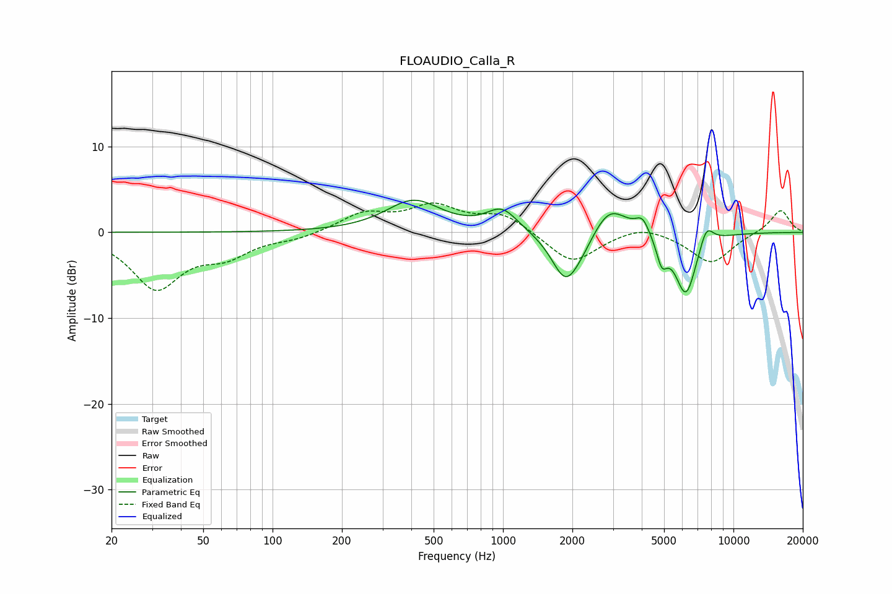

# FLOAUDIO_Calla_R
See [usage instructions](https://github.com/jaakkopasanen/AutoEq#usage) for more options and info.

### Parametric EQs
Apply preamp of -3.8 dB when using parametric equalizer.

|   # | Type    |   Fc (Hz) |    Q |   Gain (dB) |
|-----|---------|-----------|------|-------------|
|   1 | Peaking |       409 | 1.19 |         3.6 |
|   2 | Peaking |       991 | 2.06 |         2.6 |
|   3 | Peaking |      1863 | 2.31 |        -5.3 |
|   4 | Peaking |      2176 | 2    |        -1.7 |
|   5 | Peaking |      2862 | 2.12 |         0.6 |
|   6 | Peaking |      2892 | 1.75 |         3.1 |
|   7 | Peaking |      4032 | 4.71 |         1.8 |
|   8 | Peaking |      4889 | 5.98 |        -2.8 |
|   9 | Peaking |      6219 | 2.86 |        -7.4 |
|  10 | Peaking |      7622 | 4.33 |         2.5 |

### Fixed Band EQs
When using fixed band (also called graphic) equalizer, apply preamp of **-3.5 dB** (if available) and set gains manually with these parameters.

|   # | Type    |   Fc (Hz) |    Q |   Gain (dB) |
|-----|---------|-----------|------|-------------|
|   1 | Peaking |        31 | 1.41 |        -6.4 |
|   2 | Peaking |        62 | 1.41 |        -2.3 |
|   3 | Peaking |       125 | 1.41 |        -0.7 |
|   4 | Peaking |       250 | 1.41 |         2.1 |
|   5 | Peaking |       500 | 1.41 |         2.8 |
|   6 | Peaking |      1000 | 1.41 |         2.1 |
|   7 | Peaking |      2000 | 1.41 |        -3.7 |
|   8 | Peaking |      4000 | 1.41 |         1   |
|   9 | Peaking |      8000 | 1.41 |        -3.6 |
|  10 | Peaking |     16000 | 1.41 |         2.7 |

### Graphs

