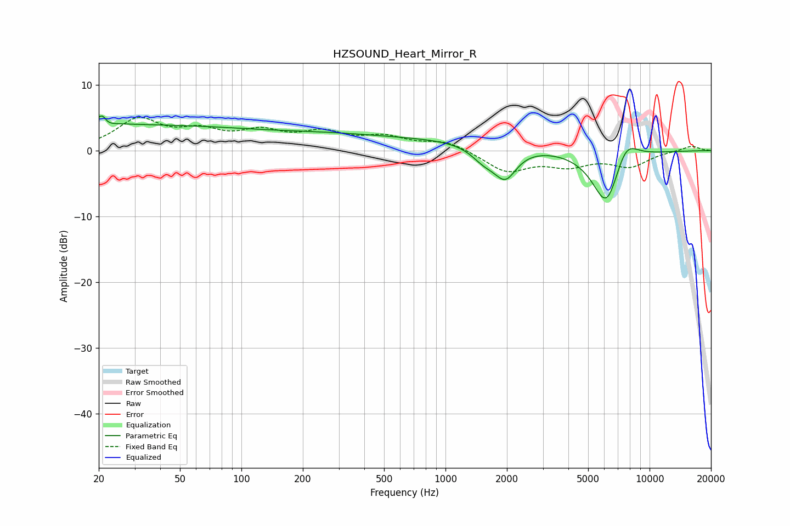

# HZSOUND_Heart_Mirror_R
See [usage instructions](https://github.com/jaakkopasanen/AutoEq#usage) for more options and info.

### Parametric EQs
Apply preamp of -5.3 dB when using parametric equalizer.

|   # | Type    |   Fc (Hz) |    Q |   Gain (dB) |
|-----|---------|-----------|------|-------------|
|   1 | Peaking |        21 | 5.97 |         2.9 |
|   2 | Peaking |        21 | 5.44 |        -1.9 |
|   3 | Peaking |        24 | 0.2  |         4.6 |
|   4 | Peaking |        34 | 0.45 |        -0.7 |
|   5 | Peaking |       238 | 0.54 |         0.7 |
|   6 | Peaking |       683 | 0.23 |         1.8 |
|   7 | Peaking |      1544 | 2.22 |        -2.1 |
|   8 | Peaking |      1967 | 2.53 |        -4.5 |
|   9 | Peaking |      6167 | 1.93 |        -9.2 |
|  10 | Peaking |      7614 | 2.19 |         4.2 |

### Fixed Band EQs
When using fixed band (also called graphic) equalizer, apply preamp of **-5.2 dB** (if available) and set gains manually with these parameters.

|   # | Type    |   Fc (Hz) |    Q |   Gain (dB) |
|-----|---------|-----------|------|-------------|
|   1 | Peaking |        31 | 1.41 |         4.5 |
|   2 | Peaking |        62 | 1.41 |         2.4 |
|   3 | Peaking |       125 | 1.41 |         2.4 |
|   4 | Peaking |       250 | 1.41 |         2.4 |
|   5 | Peaking |       500 | 1.41 |         1.8 |
|   6 | Peaking |      1000 | 1.41 |         1.4 |
|   7 | Peaking |      2000 | 1.41 |        -3.1 |
|   8 | Peaking |      4000 | 1.41 |        -2   |
|   9 | Peaking |      8000 | 1.41 |        -2.2 |
|  10 | Peaking |     16000 | 1.41 |         0.8 |

### Graphs

