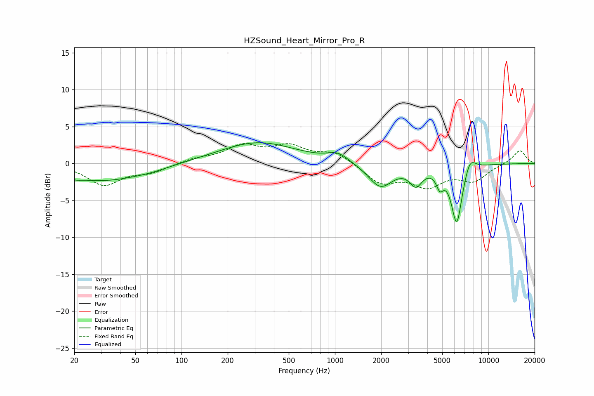

# HZSound_Heart_Mirror_Pro_R
See [usage instructions](https://github.com/jaakkopasanen/AutoEq#usage) for more options and info.

### Parametric EQs
Apply preamp of -2.9 dB when using parametric equalizer.

|   # | Type    |   Fc (Hz) |    Q |   Gain (dB) |
|-----|---------|-----------|------|-------------|
|   1 | Peaking |        20 | 3.03 |        -0.5 |
|   2 | Peaking |        30 | 0.62 |        -2.2 |
|   3 | Peaking |        61 | 0.98 |        -0.5 |
|   4 | Peaking |       314 | 0.57 |         2.9 |
|   5 | Peaking |      1047 | 2.1  |         1.2 |
|   6 | Peaking |      1980 | 1.79 |        -3.2 |
|   7 | Peaking |      3372 | 3.46 |        -2.4 |
|   8 | Peaking |      4827 | 6    |        -2   |
|   9 | Peaking |      6219 | 3.84 |        -8   |
|  10 | Peaking |      7571 | 3.65 |         2   |

### Fixed Band EQs
When using fixed band (also called graphic) equalizer, apply preamp of **-2.8 dB** (if available) and set gains manually with these parameters.

|   # | Type    |   Fc (Hz) |    Q |   Gain (dB) |
|-----|---------|-----------|------|-------------|
|   1 | Peaking |        31 | 1.41 |        -2.8 |
|   2 | Peaking |        62 | 1.41 |        -1.1 |
|   3 | Peaking |       125 | 1.41 |         0.6 |
|   4 | Peaking |       250 | 1.41 |         2.2 |
|   5 | Peaking |       500 | 1.41 |         2.1 |
|   6 | Peaking |      1000 | 1.41 |         1.5 |
|   7 | Peaking |      2000 | 1.41 |        -2.6 |
|   8 | Peaking |      4000 | 1.41 |        -2.8 |
|   9 | Peaking |      8000 | 1.41 |        -2.1 |
|  10 | Peaking |     16000 | 1.41 |         1.9 |

### Graphs

