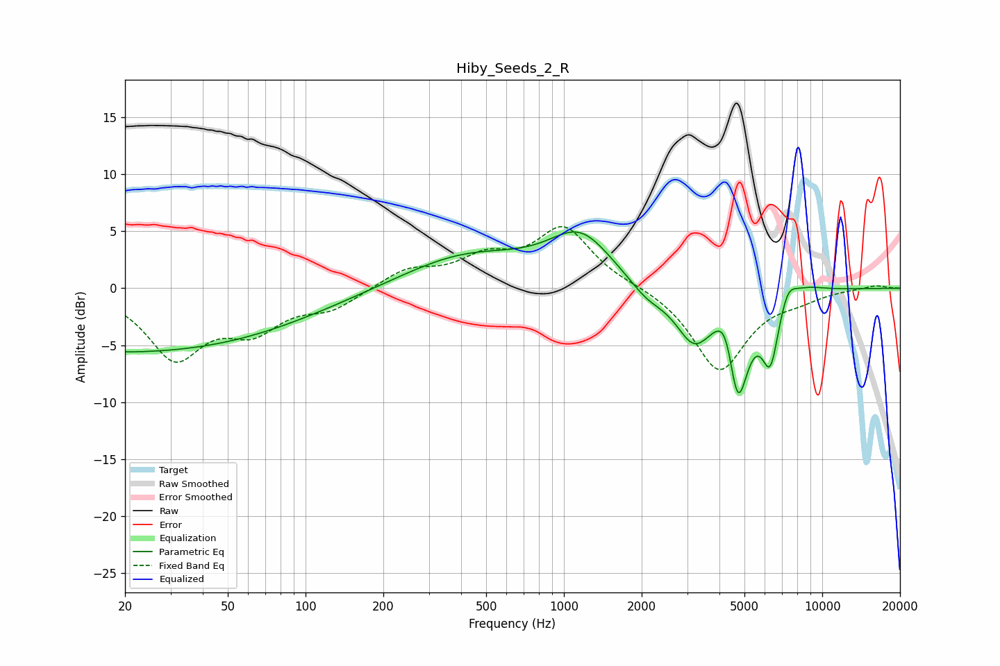

# Hiby_Seeds_2_R
See [usage instructions](https://github.com/jaakkopasanen/AutoEq#usage) for more options and info.

### Parametric EQs
Apply preamp of -5.0 dB when using parametric equalizer.

|   # | Type    |   Fc (Hz) |    Q |   Gain (dB) |
|-----|---------|-----------|------|-------------|
|   1 | Peaking |        20 | 0.19 |        -5.6 |
|   2 | Peaking |       419 | 0.57 |         2.9 |
|   3 | Peaking |      1158 | 1.15 |         4.3 |
|   4 | Peaking |      2103 | 1.96 |        -1.3 |
|   5 | Peaking |      3183 | 1.98 |        -4.4 |
|   6 | Peaking |      4266 | 3.43 |         3.7 |
|   7 | Peaking |      4698 | 3.24 |       -10   |
|   8 | Peaking |      6297 | 4.13 |        -5.6 |
|   9 | Peaking |      7353 | 4.08 |         1.6 |
|  10 | Peaking |      8627 | 1.8  |         0.6 |

### Fixed Band EQs
When using fixed band (also called graphic) equalizer, apply preamp of **-5.5 dB** (if available) and set gains manually with these parameters.

|   # | Type    |   Fc (Hz) |    Q |   Gain (dB) |
|-----|---------|-----------|------|-------------|
|   1 | Peaking |        31 | 1.41 |        -5.9 |
|   2 | Peaking |        62 | 1.41 |        -3.1 |
|   3 | Peaking |       125 | 1.41 |        -1.6 |
|   4 | Peaking |       250 | 1.41 |         1.6 |
|   5 | Peaking |       500 | 1.41 |         2.3 |
|   6 | Peaking |      1000 | 1.41 |         5.2 |
|   7 | Peaking |      2000 | 1.41 |         0.2 |
|   8 | Peaking |      4000 | 1.41 |        -7.3 |
|   9 | Peaking |      8000 | 1.41 |        -0.7 |
|  10 | Peaking |     16000 | 1.41 |         0.3 |

### Graphs

