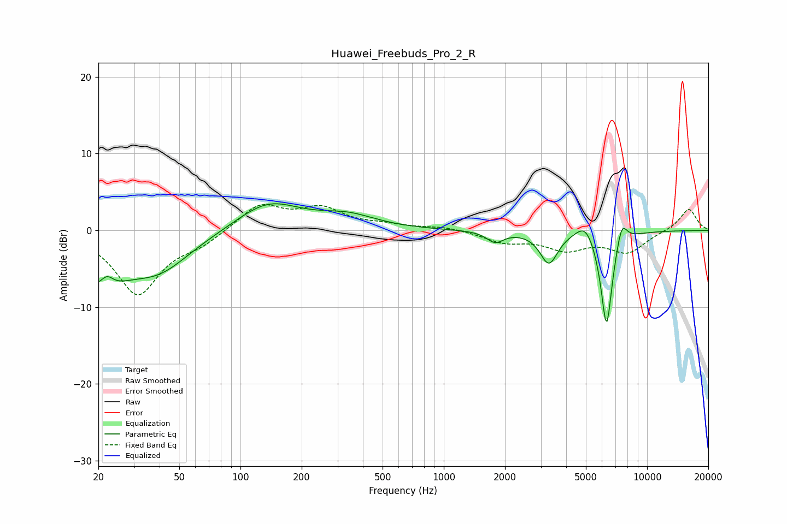

# Huawei_Freebuds_Pro_2_R
See [usage instructions](https://github.com/jaakkopasanen/AutoEq#usage) for more options and info.

### Parametric EQs
Apply preamp of -3.6 dB when using parametric equalizer.

|   # | Type    |   Fc (Hz) |    Q |   Gain (dB) |
|-----|---------|-----------|------|-------------|
|   1 | Peaking |        20 | 1.13 |        -6.2 |
|   2 | Peaking |        22 | 4.42 |         1.8 |
|   3 | Peaking |        40 | 0.88 |        -4.5 |
|   4 | Peaking |       137 | 0.91 |         3.7 |
|   5 | Peaking |       336 | 1    |         1.7 |
|   6 | Peaking |      1788 | 3.46 |        -1.4 |
|   7 | Peaking |      3289 | 3.27 |        -4.2 |
|   8 | Peaking |      4987 | 2.96 |         2.3 |
|   9 | Peaking |      6318 | 4.6  |       -13.1 |
|  10 | Peaking |      7495 | 5.07 |         3.1 |

### Fixed Band EQs
When using fixed band (also called graphic) equalizer, apply preamp of **-3.5 dB** (if available) and set gains manually with these parameters.

|   # | Type    |   Fc (Hz) |    Q |   Gain (dB) |
|-----|---------|-----------|------|-------------|
|   1 | Peaking |        31 | 1.41 |        -8.3 |
|   2 | Peaking |        62 | 1.41 |        -1.5 |
|   3 | Peaking |       125 | 1.41 |         3.4 |
|   4 | Peaking |       250 | 1.41 |         2.6 |
|   5 | Peaking |       500 | 1.41 |         0.6 |
|   6 | Peaking |      1000 | 1.41 |         0.5 |
|   7 | Peaking |      2000 | 1.41 |        -1.4 |
|   8 | Peaking |      4000 | 1.41 |        -2.2 |
|   9 | Peaking |      8000 | 1.41 |        -2.7 |
|  10 | Peaking |     16000 | 1.41 |         2.9 |

### Graphs

