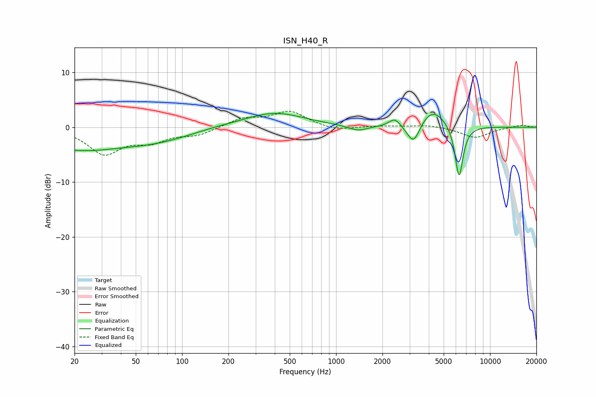

# ISN_H40_R
See [usage instructions](https://github.com/jaakkopasanen/AutoEq#usage) for more options and info.

### Parametric EQs
Apply preamp of -2.6 dB when using parametric equalizer.

|   # | Type    |   Fc (Hz) |    Q |   Gain (dB) |
|-----|---------|-----------|------|-------------|
|   1 | Peaking |        20 | 3.33 |        -0.5 |
|   2 | Peaking |        23 | 0.73 |        -3   |
|   3 | Peaking |        61 | 0.52 |        -2.5 |
|   4 | Peaking |       163 | 1.02 |         0.3 |
|   5 | Peaking |       395 | 0.73 |         2.7 |
|   6 | Peaking |      1387 | 2.17 |        -1   |
|   7 | Peaking |      2401 | 4    |         1.5 |
|   8 | Peaking |      3186 | 3.32 |        -4.1 |
|   9 | Peaking |      4224 | 1.57 |         3.6 |
|  10 | Peaking |      6289 | 5.13 |        -9.9 |

### Fixed Band EQs
When using fixed band (also called graphic) equalizer, apply preamp of **-3.0 dB** (if available) and set gains manually with these parameters.

|   # | Type    |   Fc (Hz) |    Q |   Gain (dB) |
|-----|---------|-----------|------|-------------|
|   1 | Peaking |        31 | 1.41 |        -4.7 |
|   2 | Peaking |        62 | 1.41 |        -2.2 |
|   3 | Peaking |       125 | 1.41 |        -1.3 |
|   4 | Peaking |       250 | 1.41 |         1.6 |
|   5 | Peaking |       500 | 1.41 |         2.8 |
|   6 | Peaking |      1000 | 1.41 |        -0.7 |
|   7 | Peaking |      2000 | 1.41 |         0.2 |
|   8 | Peaking |      4000 | 1.41 |         0.4 |
|   9 | Peaking |      8000 | 1.41 |        -1.9 |
|  10 | Peaking |     16000 | 1.41 |         0.4 |

### Graphs

