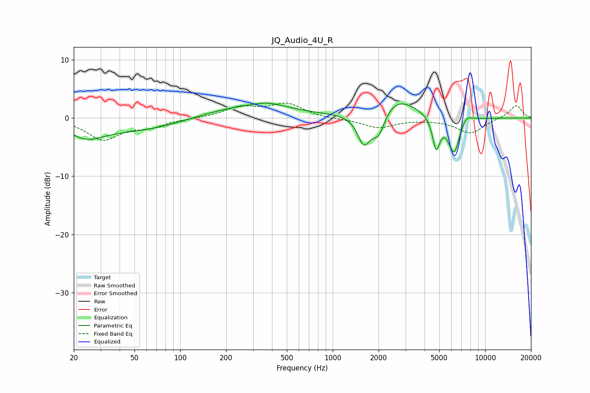

# JQ_Audio_4U_R
See [usage instructions](https://github.com/jaakkopasanen/AutoEq#usage) for more options and info.

### Parametric EQs
Apply preamp of -2.7 dB when using parametric equalizer.

|   # | Type    |   Fc (Hz) |    Q |   Gain (dB) |
|-----|---------|-----------|------|-------------|
|   1 | Peaking |        24 | 1.4  |        -2   |
|   2 | Peaking |        57 | 0.35 |        -2.6 |
|   3 | Peaking |       232 | 0.41 |         2.6 |
|   4 | Peaking |       376 | 1.54 |         0.8 |
|   5 | Peaking |      1604 | 3.25 |        -5.2 |
|   6 | Peaking |      2003 | 3.33 |        -4.1 |
|   7 | Peaking |      2622 | 1.09 |         3.6 |
|   8 | Peaking |      4778 | 5.83 |        -5.4 |
|   9 | Peaking |      6269 | 3.46 |        -6.5 |
|  10 | Peaking |      7427 | 3.36 |         1.6 |

### Fixed Band EQs
When using fixed band (also called graphic) equalizer, apply preamp of **-2.7 dB** (if available) and set gains manually with these parameters.

|   # | Type    |   Fc (Hz) |    Q |   Gain (dB) |
|-----|---------|-----------|------|-------------|
|   1 | Peaking |        31 | 1.41 |        -3.6 |
|   2 | Peaking |        62 | 1.41 |        -1.3 |
|   3 | Peaking |       125 | 1.41 |        -0   |
|   4 | Peaking |       250 | 1.41 |         1.8 |
|   5 | Peaking |       500 | 1.41 |         2.3 |
|   6 | Peaking |      1000 | 1.41 |        -0.2 |
|   7 | Peaking |      2000 | 1.41 |        -1.6 |
|   8 | Peaking |      4000 | 1.41 |        -0.1 |
|   9 | Peaking |      8000 | 1.41 |        -2.6 |
|  10 | Peaking |     16000 | 1.41 |         2.3 |

### Graphs

