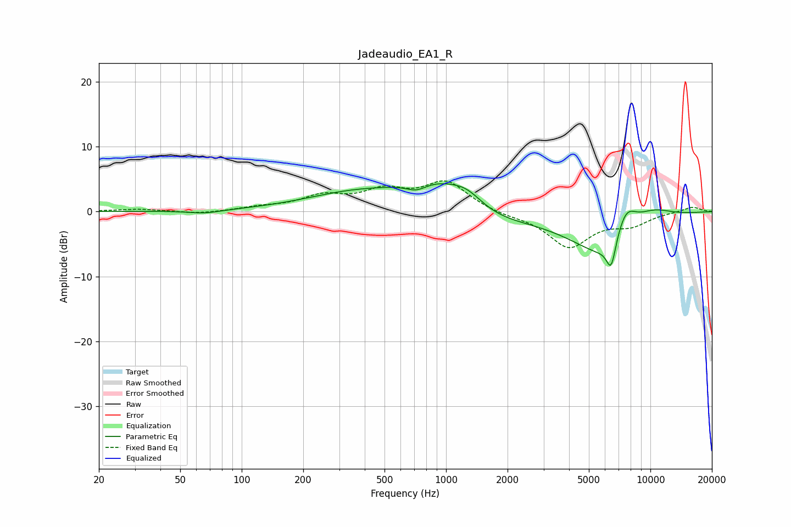

# Jadeaudio_EA1_R
See [usage instructions](https://github.com/jaakkopasanen/AutoEq#usage) for more options and info.

### Parametric EQs
Apply preamp of -4.4 dB when using parametric equalizer.

|   # | Type    |   Fc (Hz) |    Q |   Gain (dB) |
|-----|---------|-----------|------|-------------|
|   1 | Peaking |        66 | 1.85 |        -0.5 |
|   2 | Peaking |       351 | 0.57 |         2.5 |
|   3 | Peaking |       718 | 2.73 |        -1.2 |
|   4 | Peaking |       938 | 0.77 |         5.3 |
|   5 | Peaking |      1271 | 1.73 |         2.1 |
|   6 | Peaking |      1426 | 0.69 |        -3.2 |
|   7 | Peaking |      6301 | 0.79 |        -8.1 |
|   8 | Peaking |      6426 | 6    |        -4.2 |
|   9 | Peaking |      7556 | 2.3  |         5.4 |
|  10 | Peaking |      9919 | 1.07 |         3   |

### Fixed Band EQs
When using fixed band (also called graphic) equalizer, apply preamp of **-4.8 dB** (if available) and set gains manually with these parameters.

|   # | Type    |   Fc (Hz) |    Q |   Gain (dB) |
|-----|---------|-----------|------|-------------|
|   1 | Peaking |        31 | 1.41 |         0.4 |
|   2 | Peaking |        62 | 1.41 |        -0.4 |
|   3 | Peaking |       125 | 1.41 |         0.5 |
|   4 | Peaking |       250 | 1.41 |         2.1 |
|   5 | Peaking |       500 | 1.41 |         2.8 |
|   6 | Peaking |      1000 | 1.41 |         4.4 |
|   7 | Peaking |      2000 | 1.41 |        -0.5 |
|   8 | Peaking |      4000 | 1.41 |        -5.4 |
|   9 | Peaking |      8000 | 1.41 |        -1.8 |
|  10 | Peaking |     16000 | 1.41 |         0.8 |

### Graphs

