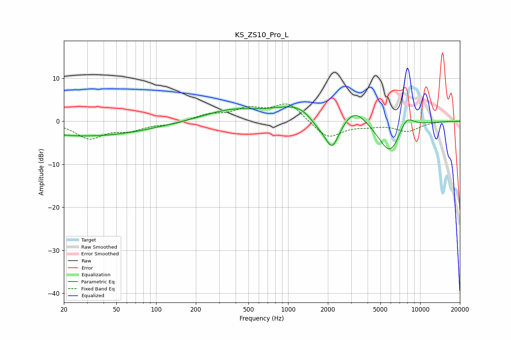

# KS_ZS10_Pro_L
See [usage instructions](https://github.com/jaakkopasanen/AutoEq#usage) for more options and info.

### Parametric EQs
Apply preamp of -3.4 dB when using parametric equalizer.

|   # | Type    |   Fc (Hz) |    Q |   Gain (dB) |
|-----|---------|-----------|------|-------------|
|   1 | Peaking |        20 | 0.34 |        -2.8 |
|   2 | Peaking |        20 | 3.81 |         0.1 |
|   3 | Peaking |        62 | 0.45 |        -1.3 |
|   4 | Peaking |       372 | 0.67 |         2.5 |
|   5 | Peaking |      1253 | 0.78 |         3.9 |
|   6 | Peaking |      1652 | 2.14 |        -2.2 |
|   7 | Peaking |      2150 | 2.4  |        -7.7 |
|   8 | Peaking |      3202 | 1.64 |         3.5 |
|   9 | Peaking |      5917 | 1.52 |        -8.1 |
|  10 | Peaking |      7832 | 2.3  |         3.6 |

### Fixed Band EQs
When using fixed band (also called graphic) equalizer, apply preamp of **-4.1 dB** (if available) and set gains manually with these parameters.

|   # | Type    |   Fc (Hz) |    Q |   Gain (dB) |
|-----|---------|-----------|------|-------------|
|   1 | Peaking |        31 | 1.41 |        -3.8 |
|   2 | Peaking |        62 | 1.41 |        -1.8 |
|   3 | Peaking |       125 | 1.41 |        -0.7 |
|   4 | Peaking |       250 | 1.41 |         1.4 |
|   5 | Peaking |       500 | 1.41 |         2.6 |
|   6 | Peaking |      1000 | 1.41 |         4.2 |
|   7 | Peaking |      2000 | 1.41 |        -4.1 |
|   8 | Peaking |      4000 | 1.41 |        -0.8 |
|   9 | Peaking |      8000 | 1.41 |        -2.2 |
|  10 | Peaking |     16000 | 1.41 |         0   |

### Graphs

