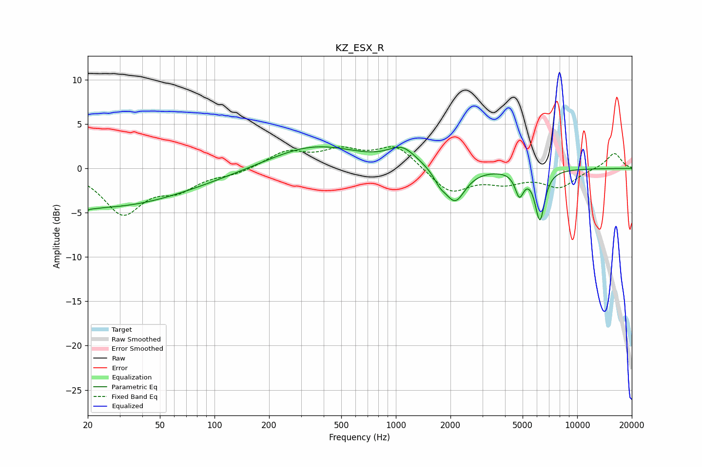

# KZ_ESX_R
See [usage instructions](https://github.com/jaakkopasanen/AutoEq#usage) for more options and info.

### Parametric EQs
Apply preamp of -2.5 dB when using parametric equalizer.

|   # | Type    |   Fc (Hz) |    Q |   Gain (dB) |
|-----|---------|-----------|------|-------------|
|   1 | Peaking |        20 | 5.58 |        -3.6 |
|   2 | Peaking |        20 | 6    |         3.2 |
|   3 | Peaking |        20 | 0.29 |        -4   |
|   4 | Peaking |        66 | 0.35 |        -0.7 |
|   5 | Peaking |       352 | 0.57 |         2.7 |
|   6 | Peaking |      1086 | 1.82 |         1.9 |
|   7 | Peaking |      1748 | 4.26 |        -1   |
|   8 | Peaking |      2121 | 2.51 |        -3.8 |
|   9 | Peaking |      4800 | 5.95 |        -2.6 |
|  10 | Peaking |      6228 | 5.18 |        -5.6 |

### Fixed Band EQs
When using fixed band (also called graphic) equalizer, apply preamp of **-2.5 dB** (if available) and set gains manually with these parameters.

|   # | Type    |   Fc (Hz) |    Q |   Gain (dB) |
|-----|---------|-----------|------|-------------|
|   1 | Peaking |        31 | 1.41 |        -4.9 |
|   2 | Peaking |        62 | 1.41 |        -2   |
|   3 | Peaking |       125 | 1.41 |        -0.6 |
|   4 | Peaking |       250 | 1.41 |         1.8 |
|   5 | Peaking |       500 | 1.41 |         1.8 |
|   6 | Peaking |      1000 | 1.41 |         2.5 |
|   7 | Peaking |      2000 | 1.41 |        -2.8 |
|   8 | Peaking |      4000 | 1.41 |        -1.3 |
|   9 | Peaking |      8000 | 1.41 |        -2   |
|  10 | Peaking |     16000 | 1.41 |         1.8 |

### Graphs

