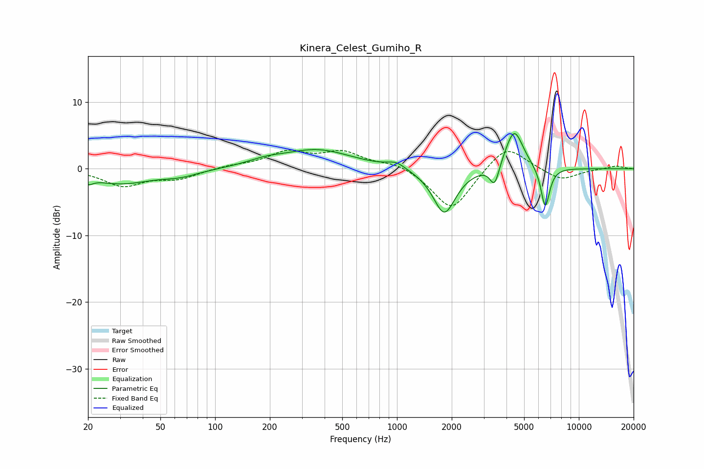

# Kinera_Celest_Gumiho_R
See [usage instructions](https://github.com/jaakkopasanen/AutoEq#usage) for more options and info.

### Parametric EQs
Apply preamp of -5.4 dB when using parametric equalizer.

|   # | Type    |   Fc (Hz) |    Q |   Gain (dB) |
|-----|---------|-----------|------|-------------|
|   1 | Peaking |        20 | 5.23 |        -0.9 |
|   2 | Peaking |        30 | 0.84 |        -2.1 |
|   3 | Peaking |        64 | 1.35 |        -0.8 |
|   4 | Peaking |       189 | 1.46 |         0.7 |
|   5 | Peaking |       364 | 0.75 |         2.8 |
|   6 | Peaking |       988 | 2.86 |         0.9 |
|   7 | Peaking |      1821 | 2.25 |        -6.9 |
|   8 | Peaking |      3443 | 5.51 |        -3.3 |
|   9 | Peaking |      4409 | 2.81 |         6.2 |
|  10 | Peaking |      6535 | 5.66 |        -6.2 |

### Fixed Band EQs
When using fixed band (also called graphic) equalizer, apply preamp of **-2.9 dB** (if available) and set gains manually with these parameters.

|   # | Type    |   Fc (Hz) |    Q |   Gain (dB) |
|-----|---------|-----------|------|-------------|
|   1 | Peaking |        31 | 1.41 |        -2.5 |
|   2 | Peaking |        62 | 1.41 |        -1.4 |
|   3 | Peaking |       125 | 1.41 |         0.4 |
|   4 | Peaking |       250 | 1.41 |         2.4 |
|   5 | Peaking |       500 | 1.41 |         2.3 |
|   6 | Peaking |      1000 | 1.41 |         1   |
|   7 | Peaking |      2000 | 1.41 |        -6.4 |
|   8 | Peaking |      4000 | 1.41 |         3.9 |
|   9 | Peaking |      8000 | 1.41 |        -1.8 |
|  10 | Peaking |     16000 | 1.41 |         0.5 |

### Graphs

