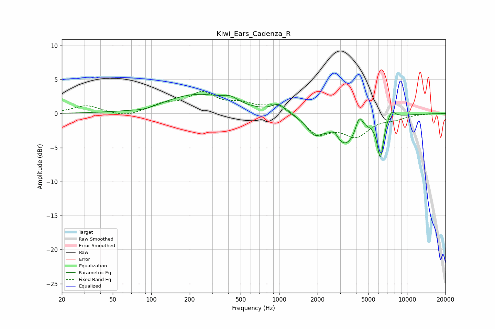

# Kiwi_Ears_Cadenza_R
See [usage instructions](https://github.com/jaakkopasanen/AutoEq#usage) for more options and info.

### Parametric EQs
Apply preamp of -2.9 dB when using parametric equalizer.

|   # | Type    |   Fc (Hz) |    Q |   Gain (dB) |
|-----|---------|-----------|------|-------------|
|   1 | Peaking |        88 | 1.61 |        -0.4 |
|   2 | Peaking |       226 | 0.57 |         2.8 |
|   3 | Peaking |       415 | 2.29 |         0.8 |
|   4 | Peaking |       991 | 2.73 |         1.3 |
|   5 | Peaking |      1884 | 2.49 |        -2.1 |
|   6 | Peaking |      2698 | 4.72 |         1.1 |
|   7 | Peaking |      3292 | 1.29 |        -4.6 |
|   8 | Peaking |      4233 | 4.93 |         2.5 |
|   9 | Peaking |      6189 | 5.59 |        -5.7 |
|  10 | Peaking |      7556 | 4.27 |         1.4 |

### Fixed Band EQs
When using fixed band (also called graphic) equalizer, apply preamp of **-3.3 dB** (if available) and set gains manually with these parameters.

|   # | Type    |   Fc (Hz) |    Q |   Gain (dB) |
|-----|---------|-----------|------|-------------|
|   1 | Peaking |        31 | 1.41 |         1.2 |
|   2 | Peaking |        62 | 1.41 |        -0.6 |
|   3 | Peaking |       125 | 1.41 |         1.2 |
|   4 | Peaking |       250 | 1.41 |         2.8 |
|   5 | Peaking |       500 | 1.41 |         1.2 |
|   6 | Peaking |      1000 | 1.41 |         1.5 |
|   7 | Peaking |      2000 | 1.41 |        -2.9 |
|   8 | Peaking |      4000 | 1.41 |        -3   |
|   9 | Peaking |      8000 | 1.41 |        -0.6 |
|  10 | Peaking |     16000 | 1.41 |         0   |

### Graphs

