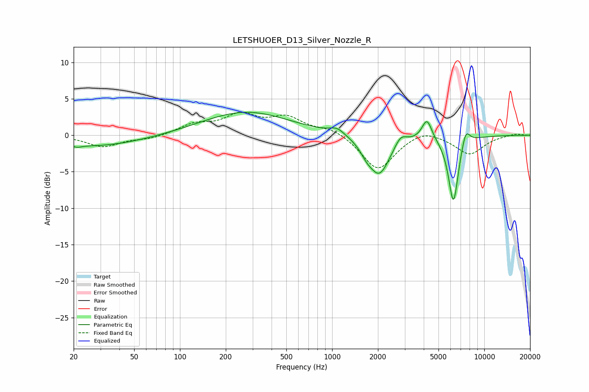

# LETSHUOER_D13_Silver_Nozzle_R
See [usage instructions](https://github.com/jaakkopasanen/AutoEq#usage) for more options and info.

### Parametric EQs
Apply preamp of -3.2 dB when using parametric equalizer.

|   # | Type    |   Fc (Hz) |    Q |   Gain (dB) |
|-----|---------|-----------|------|-------------|
|   1 | Peaking |        21 | 5.09 |        -0.3 |
|   2 | Peaking |        28 | 0.45 |        -1.5 |
|   3 | Peaking |       271 | 0.5  |         3.2 |
|   4 | Peaking |      1079 | 2.89 |         0.9 |
|   5 | Peaking |      1675 | 3.7  |        -0.9 |
|   6 | Peaking |      2038 | 1.99 |        -5.4 |
|   7 | Peaking |      2820 | 3.68 |         1.4 |
|   8 | Peaking |      4199 | 4.31 |         2.8 |
|   9 | Peaking |      6269 | 4.08 |        -9.3 |
|  10 | Peaking |      7547 | 4.92 |         2.3 |

### Fixed Band EQs
When using fixed band (also called graphic) equalizer, apply preamp of **-3.3 dB** (if available) and set gains manually with these parameters.

|   # | Type    |   Fc (Hz) |    Q |   Gain (dB) |
|-----|---------|-----------|------|-------------|
|   1 | Peaking |        31 | 1.41 |        -1.6 |
|   2 | Peaking |        62 | 1.41 |        -0.5 |
|   3 | Peaking |       125 | 1.41 |         1.4 |
|   4 | Peaking |       250 | 1.41 |         2.5 |
|   5 | Peaking |       500 | 1.41 |         2.2 |
|   6 | Peaking |      1000 | 1.41 |         1   |
|   7 | Peaking |      2000 | 1.41 |        -4.8 |
|   8 | Peaking |      4000 | 1.41 |         1   |
|   9 | Peaking |      8000 | 1.41 |        -2.6 |
|  10 | Peaking |     16000 | 1.41 |         0.2 |

### Graphs

