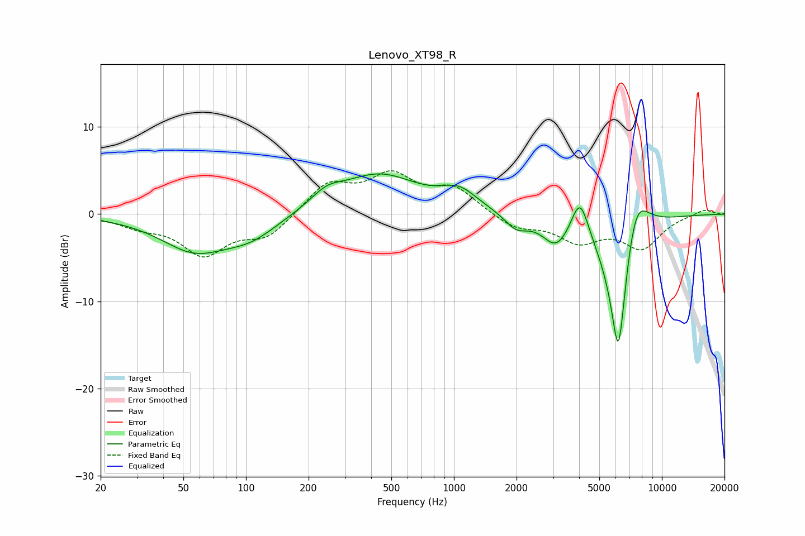

# Lenovo_XT98_R
See [usage instructions](https://github.com/jaakkopasanen/AutoEq#usage) for more options and info.

### Parametric EQs
Apply preamp of -4.7 dB when using parametric equalizer.

|   # | Type    |   Fc (Hz) |    Q |   Gain (dB) |
|-----|---------|-----------|------|-------------|
|   1 | Peaking |        57 | 0.86 |        -4   |
|   2 | Peaking |       106 | 1.08 |        -2.1 |
|   3 | Peaking |       244 | 1.84 |         1.5 |
|   4 | Peaking |       436 | 0.74 |         4.4 |
|   5 | Peaking |      1060 | 1.63 |         2.1 |
|   6 | Peaking |      1996 | 2.52 |        -1.7 |
|   7 | Peaking |      3100 | 2.19 |        -3.1 |
|   8 | Peaking |      4036 | 3.4  |         4.6 |
|   9 | Peaking |      6183 | 2.72 |       -18.6 |
|  10 | Peaking |      7441 | 2.07 |         6.9 |

### Fixed Band EQs
When using fixed band (also called graphic) equalizer, apply preamp of **-5.1 dB** (if available) and set gains manually with these parameters.

|   # | Type    |   Fc (Hz) |    Q |   Gain (dB) |
|-----|---------|-----------|------|-------------|
|   1 | Peaking |        31 | 1.41 |        -1.2 |
|   2 | Peaking |        62 | 1.41 |        -4.4 |
|   3 | Peaking |       125 | 1.41 |        -2.6 |
|   4 | Peaking |       250 | 1.41 |         3.4 |
|   5 | Peaking |       500 | 1.41 |         4   |
|   6 | Peaking |      1000 | 1.41 |         2.8 |
|   7 | Peaking |      2000 | 1.41 |        -1.6 |
|   8 | Peaking |      4000 | 1.41 |        -2.9 |
|   9 | Peaking |      8000 | 1.41 |        -3.7 |
|  10 | Peaking |     16000 | 1.41 |         0.6 |

### Graphs

