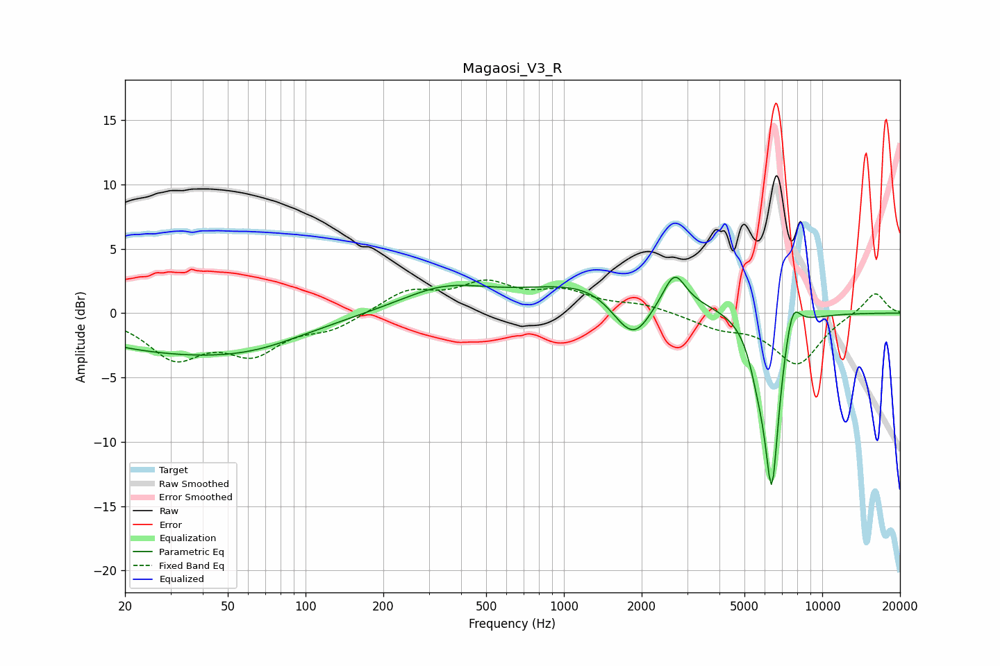

# Magaosi_V3_R
See [usage instructions](https://github.com/jaakkopasanen/AutoEq#usage) for more options and info.

### Parametric EQs
Apply preamp of -2.9 dB when using parametric equalizer.

|   # | Type    |   Fc (Hz) |    Q |   Gain (dB) |
|-----|---------|-----------|------|-------------|
|   1 | Peaking |        29 | 0.4  |        -2.6 |
|   2 | Peaking |        64 | 0.66 |        -1.2 |
|   3 | Peaking |       344 | 0.82 |         1.8 |
|   4 | Peaking |      1407 | 0.51 |         2.5 |
|   5 | Peaking |      1663 | 1.96 |        -1   |
|   6 | Peaking |      1891 | 2.05 |        -3.1 |
|   7 | Peaking |      2681 | 3.39 |         2.5 |
|   8 | Peaking |      5647 | 3.84 |        -2.4 |
|   9 | Peaking |      6380 | 4.6  |       -13.1 |
|  10 | Peaking |      7656 | 4.38 |         2.8 |

### Fixed Band EQs
When using fixed band (also called graphic) equalizer, apply preamp of **-2.7 dB** (if available) and set gains manually with these parameters.

|   # | Type    |   Fc (Hz) |    Q |   Gain (dB) |
|-----|---------|-----------|------|-------------|
|   1 | Peaking |        31 | 1.41 |        -3.2 |
|   2 | Peaking |        62 | 1.41 |        -2.8 |
|   3 | Peaking |       125 | 1.41 |        -1.1 |
|   4 | Peaking |       250 | 1.41 |         1.7 |
|   5 | Peaking |       500 | 1.41 |         2.1 |
|   6 | Peaking |      1000 | 1.41 |         1.4 |
|   7 | Peaking |      2000 | 1.41 |         0.6 |
|   8 | Peaking |      4000 | 1.41 |        -1   |
|   9 | Peaking |      8000 | 1.41 |        -3.9 |
|  10 | Peaking |     16000 | 1.41 |         1.7 |

### Graphs

