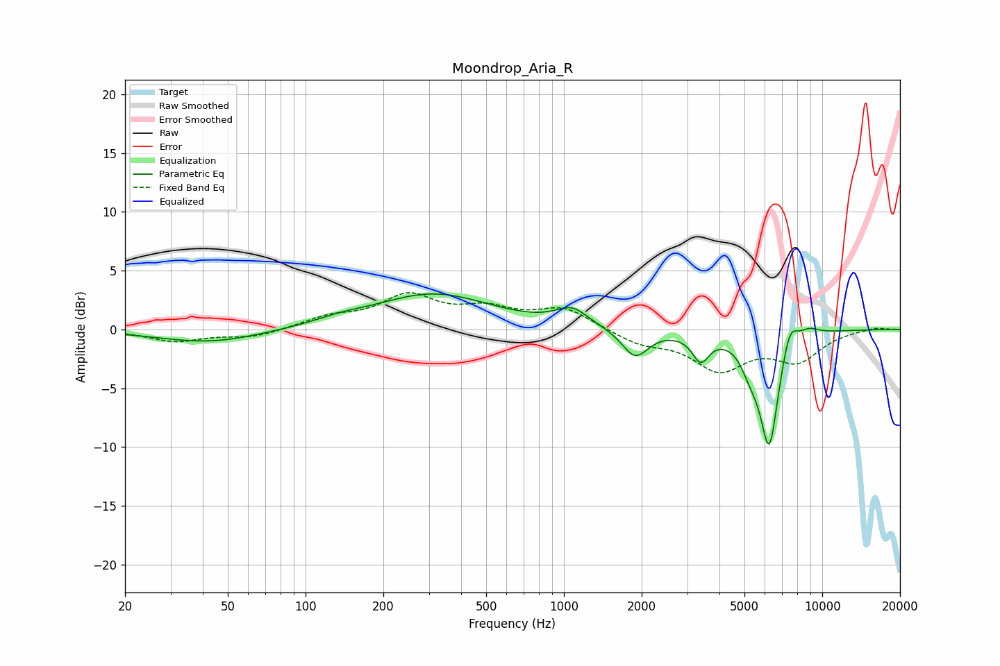

# Moondrop_Aria_R
See [usage instructions](https://github.com/jaakkopasanen/AutoEq#usage) for more options and info.

### Parametric EQs
Apply preamp of -3.1 dB when using parametric equalizer.

|   # | Type    |   Fc (Hz) |    Q |   Gain (dB) |
|-----|---------|-----------|------|-------------|
|   1 | Peaking |        42 | 0.71 |        -1.1 |
|   2 | Peaking |       136 | 1.44 |         0.4 |
|   3 | Peaking |       312 | 0.63 |         3   |
|   4 | Peaking |      1074 | 2.28 |         1.5 |
|   5 | Peaking |      1887 | 2.76 |        -2.4 |
|   6 | Peaking |      3387 | 4.25 |        -2.2 |
|   7 | Peaking |      5276 | 3.69 |        -1.8 |
|   8 | Peaking |      6238 | 3.75 |        -9.6 |
|   9 | Peaking |      7491 | 4.57 |         2.2 |
|  10 | Peaking |      8890 | 3.25 |         0.6 |

### Fixed Band EQs
When using fixed band (also called graphic) equalizer, apply preamp of **-3.2 dB** (if available) and set gains manually with these parameters.

|   # | Type    |   Fc (Hz) |    Q |   Gain (dB) |
|-----|---------|-----------|------|-------------|
|   1 | Peaking |        31 | 1.41 |        -1   |
|   2 | Peaking |        62 | 1.41 |        -0.7 |
|   3 | Peaking |       125 | 1.41 |         0.9 |
|   4 | Peaking |       250 | 1.41 |         2.7 |
|   5 | Peaking |       500 | 1.41 |         1.5 |
|   6 | Peaking |      1000 | 1.41 |         1.7 |
|   7 | Peaking |      2000 | 1.41 |        -1.1 |
|   8 | Peaking |      4000 | 1.41 |        -3.2 |
|   9 | Peaking |      8000 | 1.41 |        -2.5 |
|  10 | Peaking |     16000 | 1.41 |         0.2 |

### Graphs

