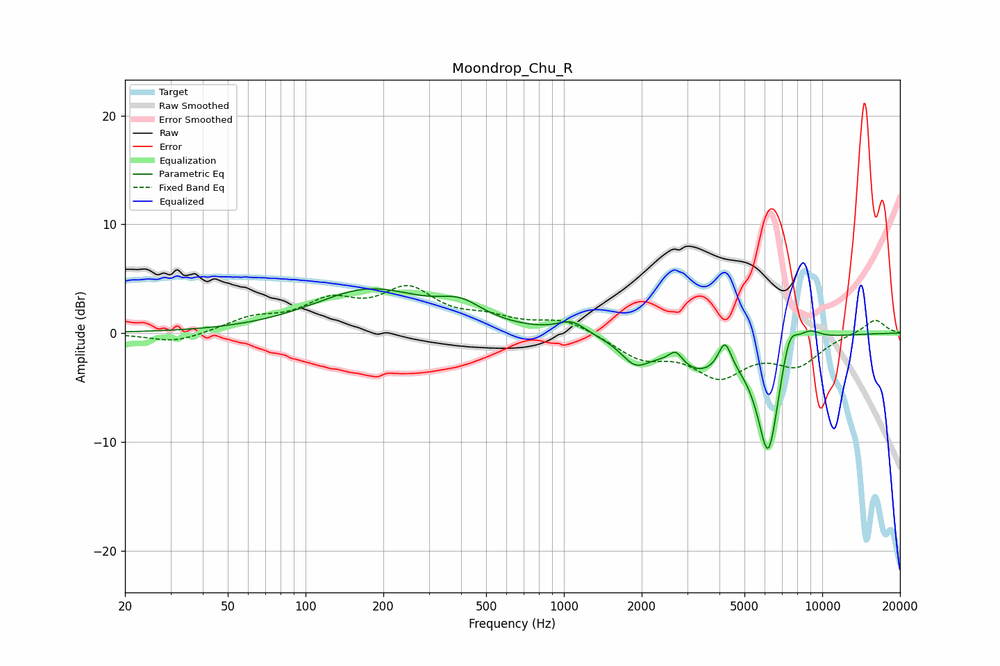

# Moondrop_Chu_R
See [usage instructions](https://github.com/jaakkopasanen/AutoEq#usage) for more options and info.

### Parametric EQs
Apply preamp of -4.2 dB when using parametric equalizer.

|   # | Type    |   Fc (Hz) |    Q |   Gain (dB) |
|-----|---------|-----------|------|-------------|
|   1 | Peaking |       177 | 0.65 |         3.9 |
|   2 | Peaking |       398 | 1.63 |         1.6 |
|   3 | Peaking |      1073 | 2.61 |         1.2 |
|   4 | Peaking |      1887 | 2.61 |        -2   |
|   5 | Peaking |      2711 | 5.15 |         1.3 |
|   6 | Peaking |      3327 | 1.09 |        -3.1 |
|   7 | Peaking |      4199 | 5.49 |         2.7 |
|   8 | Peaking |      6183 | 3.09 |       -10.7 |
|   9 | Peaking |      7449 | 4.07 |         3   |
|  10 | Peaking |      8881 | 2.69 |         1.2 |

### Fixed Band EQs
When using fixed band (also called graphic) equalizer, apply preamp of **-4.5 dB** (if available) and set gains manually with these parameters.

|   # | Type    |   Fc (Hz) |    Q |   Gain (dB) |
|-----|---------|-----------|------|-------------|
|   1 | Peaking |        31 | 1.41 |        -0.9 |
|   2 | Peaking |        62 | 1.41 |         1.2 |
|   3 | Peaking |       125 | 1.41 |         2.5 |
|   4 | Peaking |       250 | 1.41 |         3.6 |
|   5 | Peaking |       500 | 1.41 |         1.1 |
|   6 | Peaking |      1000 | 1.41 |         1.2 |
|   7 | Peaking |      2000 | 1.41 |        -2.1 |
|   8 | Peaking |      4000 | 1.41 |        -3.6 |
|   9 | Peaking |      8000 | 1.41 |        -2.7 |
|  10 | Peaking |     16000 | 1.41 |         1.3 |

### Graphs

