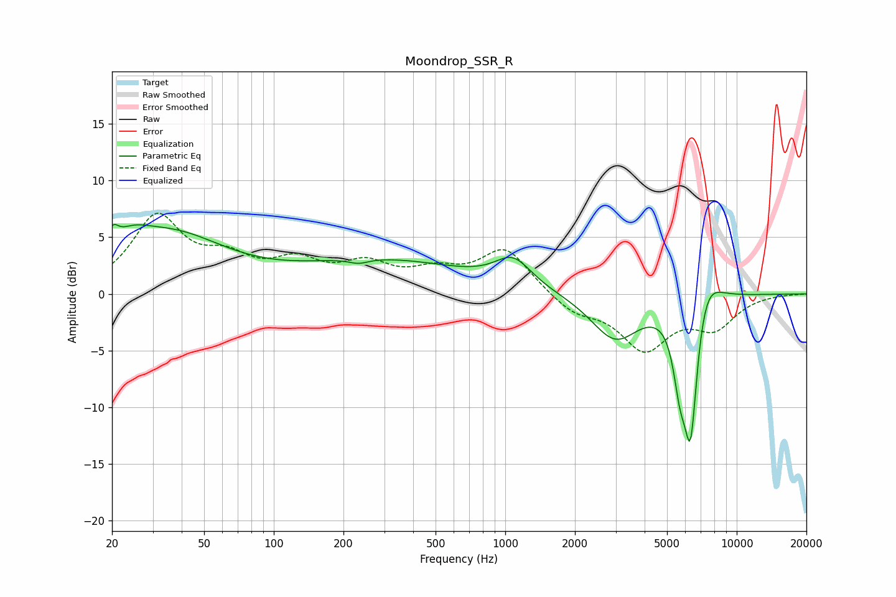

# Moondrop_SSR_R
See [usage instructions](https://github.com/jaakkopasanen/AutoEq#usage) for more options and info.

### Parametric EQs
Apply preamp of -6.2 dB when using parametric equalizer.

|   # | Type    |   Fc (Hz) |    Q |   Gain (dB) |
|-----|---------|-----------|------|-------------|
|   1 | Peaking |        20 | 5.71 |         1.6 |
|   2 | Peaking |        24 | 1.86 |         1.5 |
|   3 | Peaking |        35 | 0.58 |         5   |
|   4 | Peaking |       232 | 3.46 |        -0.4 |
|   5 | Peaking |       299 | 0.38 |         2.8 |
|   6 | Peaking |      1083 | 1.79 |         2.5 |
|   7 | Peaking |      2985 | 1.35 |        -4   |
|   8 | Peaking |      5680 | 4.79 |        -4.5 |
|   9 | Peaking |      6321 | 4.15 |       -12.9 |
|  10 | Peaking |      7234 | 2.15 |         3.8 |

### Fixed Band EQs
When using fixed band (also called graphic) equalizer, apply preamp of **-7.2 dB** (if available) and set gains manually with these parameters.

|   # | Type    |   Fc (Hz) |    Q |   Gain (dB) |
|-----|---------|-----------|------|-------------|
|   1 | Peaking |        31 | 1.41 |         6.6 |
|   2 | Peaking |        62 | 1.41 |         2.4 |
|   3 | Peaking |       125 | 1.41 |         2.4 |
|   4 | Peaking |       250 | 1.41 |         2.2 |
|   5 | Peaking |       500 | 1.41 |         1.6 |
|   6 | Peaking |      1000 | 1.41 |         3.9 |
|   7 | Peaking |      2000 | 1.41 |        -1.6 |
|   8 | Peaking |      4000 | 1.41 |        -4.6 |
|   9 | Peaking |      8000 | 1.41 |        -2.7 |
|  10 | Peaking |     16000 | 1.41 |        -0   |

### Graphs

