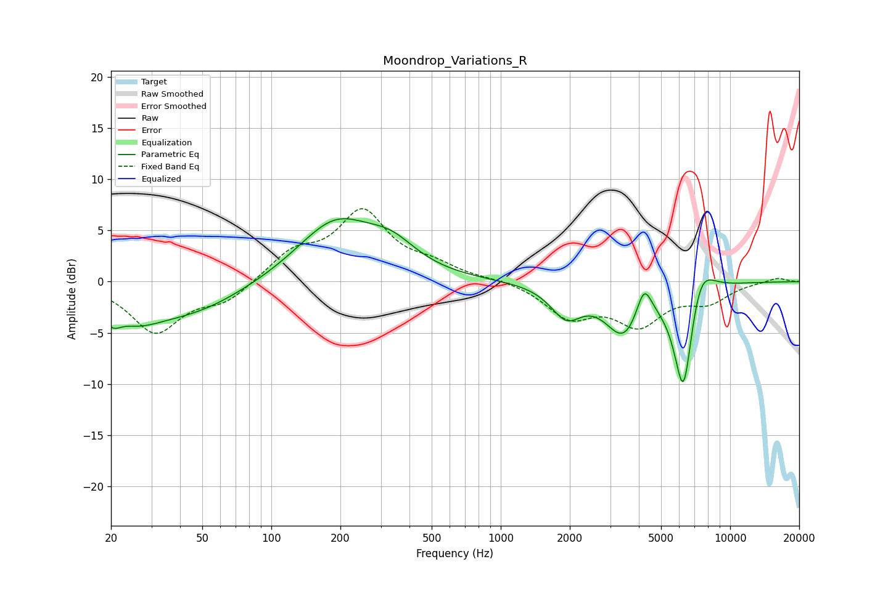

# Moondrop_Variations_R
See [usage instructions](https://github.com/jaakkopasanen/AutoEq#usage) for more options and info.

### Parametric EQs
Apply preamp of -6.2 dB when using parametric equalizer.

|   # | Type    |   Fc (Hz) |    Q |   Gain (dB) |
|-----|---------|-----------|------|-------------|
|   1 | Peaking |        20 | 4    |        -1.6 |
|   2 | Peaking |        26 | 1.25 |        -2.3 |
|   3 | Peaking |        44 | 0.61 |        -2.9 |
|   4 | Peaking |       190 | 0.84 |         5.8 |
|   5 | Peaking |       335 | 1.28 |         2.3 |
|   6 | Peaking |      1929 | 2.09 |        -3   |
|   7 | Peaking |      3439 | 1.74 |        -4.9 |
|   8 | Peaking |      4213 | 4.21 |         3.2 |
|   9 | Peaking |      6262 | 3.15 |       -11.4 |
|  10 | Peaking |      7354 | 2.32 |         4   |

### Fixed Band EQs
When using fixed band (also called graphic) equalizer, apply preamp of **-7.2 dB** (if available) and set gains manually with these parameters.

|   # | Type    |   Fc (Hz) |    Q |   Gain (dB) |
|-----|---------|-----------|------|-------------|
|   1 | Peaking |        31 | 1.41 |        -4.9 |
|   2 | Peaking |        62 | 1.41 |        -1.8 |
|   3 | Peaking |       125 | 1.41 |         2.6 |
|   4 | Peaking |       250 | 1.41 |         6.5 |
|   5 | Peaking |       500 | 1.41 |         1.3 |
|   6 | Peaking |      1000 | 1.41 |         0.2 |
|   7 | Peaking |      2000 | 1.41 |        -3.2 |
|   8 | Peaking |      4000 | 1.41 |        -3.9 |
|   9 | Peaking |      8000 | 1.41 |        -1.7 |
|  10 | Peaking |     16000 | 1.41 |         0.4 |

### Graphs

