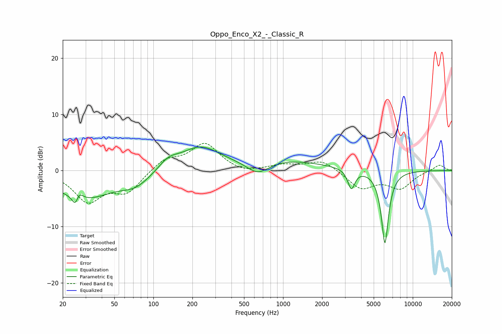

# Oppo_Enco_X2_-_Classic_R
See [usage instructions](https://github.com/jaakkopasanen/AutoEq#usage) for more options and info.

### Parametric EQs
Apply preamp of -4.3 dB when using parametric equalizer.

|   # | Type    |   Fc (Hz) |    Q |   Gain (dB) |
|-----|---------|-----------|------|-------------|
|   1 | Peaking |        25 | 5.41 |        -4.5 |
|   2 | Peaking |        26 | 4.68 |         4.1 |
|   3 | Peaking |        29 | 0.67 |        -4.9 |
|   4 | Peaking |        73 | 1.22 |        -2.1 |
|   5 | Peaking |       131 | 1.87 |         1.7 |
|   6 | Peaking |       230 | 0.93 |         4   |
|   7 | Peaking |       638 | 1.61 |        -2.4 |
|   8 | Peaking |       990 | 0.46 |         1.9 |
|   9 | Peaking |      3361 | 5.28 |        -3.5 |
|  10 | Peaking |      6100 | 4.86 |       -13.1 |

### Fixed Band EQs
When using fixed band (also called graphic) equalizer, apply preamp of **-4.9 dB** (if available) and set gains manually with these parameters.

|   # | Type    |   Fc (Hz) |    Q |   Gain (dB) |
|-----|---------|-----------|------|-------------|
|   1 | Peaking |        31 | 1.41 |        -5.3 |
|   2 | Peaking |        62 | 1.41 |        -3.6 |
|   3 | Peaking |       125 | 1.41 |         2   |
|   4 | Peaking |       250 | 1.41 |         4.7 |
|   5 | Peaking |       500 | 1.41 |        -0.7 |
|   6 | Peaking |      1000 | 1.41 |         0.9 |
|   7 | Peaking |      2000 | 1.41 |         1.9 |
|   8 | Peaking |      4000 | 1.41 |        -3.2 |
|   9 | Peaking |      8000 | 1.41 |        -3   |
|  10 | Peaking |     16000 | 1.41 |         1.1 |

### Graphs

