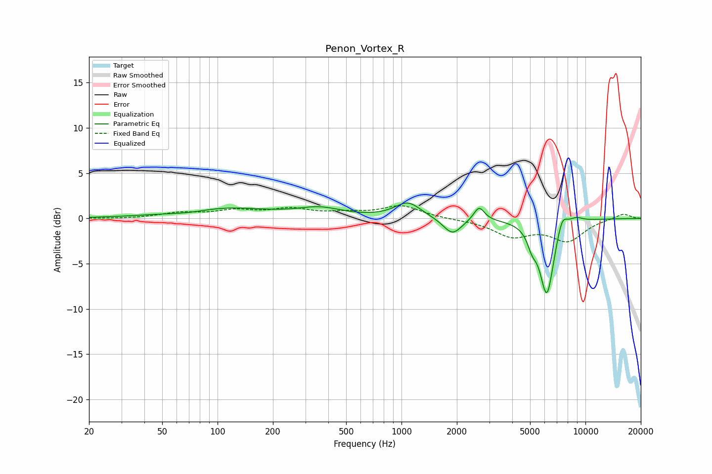

# Penon_Vortex_R
See [usage instructions](https://github.com/jaakkopasanen/AutoEq#usage) for more options and info.

### Parametric EQs
Apply preamp of -1.8 dB when using parametric equalizer.

|   # | Type    |   Fc (Hz) |    Q |   Gain (dB) |
|-----|---------|-----------|------|-------------|
|   1 | Peaking |        71 | 1.17 |        -0.4 |
|   2 | Peaking |       101 | 0.57 |         1.3 |
|   3 | Peaking |       359 | 1.18 |         1   |
|   4 | Peaking |      1084 | 2.01 |         1.7 |
|   5 | Peaking |      1892 | 2.81 |        -1.8 |
|   6 | Peaking |      2641 | 4.88 |         1.6 |
|   7 | Peaking |      5127 | 5.49 |        -1.5 |
|   8 | Peaking |      6171 | 3.5  |        -8.4 |
|   9 | Peaking |      7471 | 4.61 |         1.9 |
|  10 | Peaking |      8869 | 3.26 |         0.6 |

### Fixed Band EQs
When using fixed band (also called graphic) equalizer, apply preamp of **-1.5 dB** (if available) and set gains manually with these parameters.

|   # | Type    |   Fc (Hz) |    Q |   Gain (dB) |
|-----|---------|-----------|------|-------------|
|   1 | Peaking |        31 | 1.41 |        -0   |
|   2 | Peaking |        62 | 1.41 |         0.6 |
|   3 | Peaking |       125 | 1.41 |         0.8 |
|   4 | Peaking |       250 | 1.41 |         0.9 |
|   5 | Peaking |       500 | 1.41 |         0.5 |
|   6 | Peaking |      1000 | 1.41 |         1.4 |
|   7 | Peaking |      2000 | 1.41 |        -0.1 |
|   8 | Peaking |      4000 | 1.41 |        -1.8 |
|   9 | Peaking |      8000 | 1.41 |        -2.4 |
|  10 | Peaking |     16000 | 1.41 |         0.6 |

### Graphs

