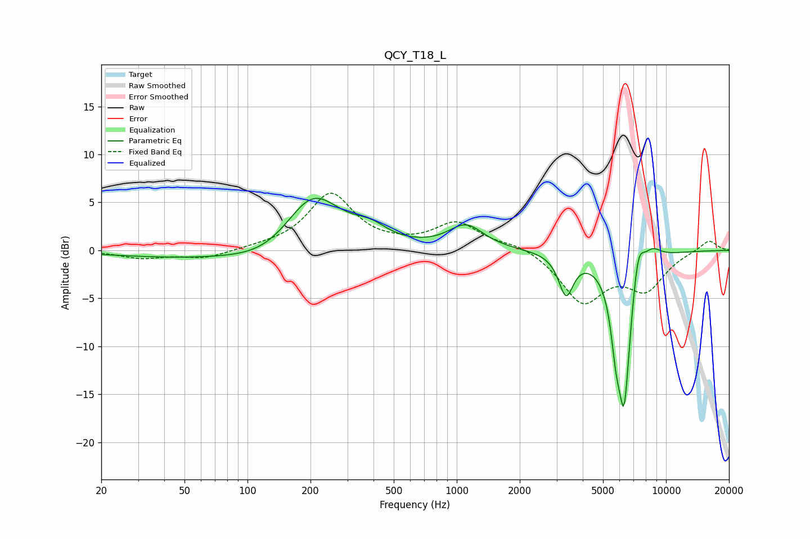

# QCY_T18_L
See [usage instructions](https://github.com/jaakkopasanen/AutoEq#usage) for more options and info.

### Parametric EQs
Apply preamp of -5.5 dB when using parametric equalizer.

|   # | Type    |   Fc (Hz) |    Q |   Gain (dB) |
|-----|---------|-----------|------|-------------|
|   1 | Peaking |        66 | 0.32 |        -0.9 |
|   2 | Peaking |       130 | 0.9  |        -1.5 |
|   3 | Peaking |       204 | 1.02 |         6.5 |
|   4 | Peaking |       387 | 1.76 |         1.3 |
|   5 | Peaking |      1108 | 1.69 |         2.5 |
|   6 | Peaking |      3328 | 4.05 |        -4.2 |
|   7 | Peaking |      5763 | 5.93 |        -4.3 |
|   8 | Peaking |      6309 | 4    |       -15.7 |
|   9 | Peaking |      7350 | 4.64 |         4.1 |
|  10 | Peaking |      8556 | 2.89 |         1.4 |

### Fixed Band EQs
When using fixed band (also called graphic) equalizer, apply preamp of **-6.1 dB** (if available) and set gains manually with these parameters.

|   # | Type    |   Fc (Hz) |    Q |   Gain (dB) |
|-----|---------|-----------|------|-------------|
|   1 | Peaking |        31 | 1.41 |        -0.8 |
|   2 | Peaking |        62 | 1.41 |        -0.8 |
|   3 | Peaking |       125 | 1.41 |         0.2 |
|   4 | Peaking |       250 | 1.41 |         5.8 |
|   5 | Peaking |       500 | 1.41 |         0.2 |
|   6 | Peaking |      1000 | 1.41 |         2.8 |
|   7 | Peaking |      2000 | 1.41 |         0.7 |
|   8 | Peaking |      4000 | 1.41 |        -5.2 |
|   9 | Peaking |      8000 | 1.41 |        -3.7 |
|  10 | Peaking |     16000 | 1.41 |         1.2 |

### Graphs

