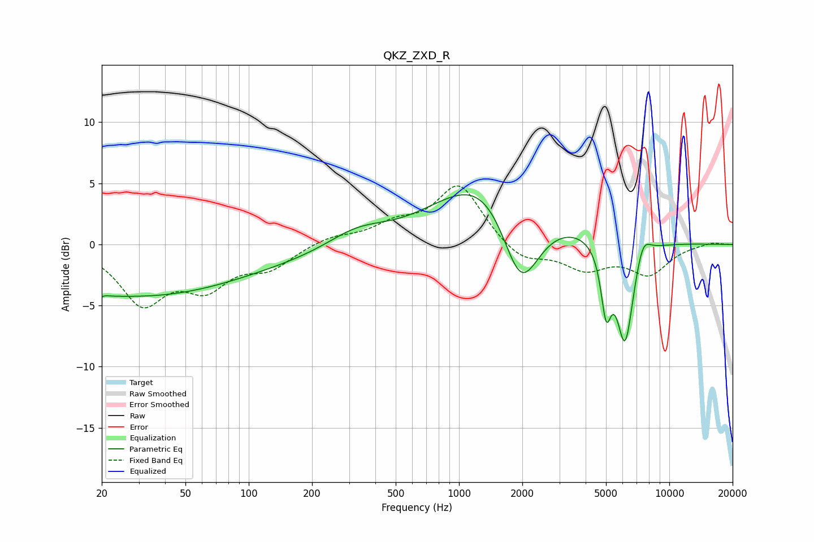

# QKZ_ZXD_R
See [usage instructions](https://github.com/jaakkopasanen/AutoEq#usage) for more options and info.

### Parametric EQs
Apply preamp of -4.2 dB when using parametric equalizer.

|   # | Type    |   Fc (Hz) |    Q |   Gain (dB) |
|-----|---------|-----------|------|-------------|
|   1 | Peaking |        20 | 5.35 |        -3.4 |
|   2 | Peaking |        20 | 5.56 |         3.2 |
|   3 | Peaking |        24 | 0.28 |        -3.9 |
|   4 | Peaking |       227 | 0.19 |        -1.2 |
|   5 | Peaking |       327 | 0.94 |         1.6 |
|   6 | Peaking |      1532 | 0.54 |         8.7 |
|   7 | Peaking |      1961 | 1.29 |        -9.8 |
|   8 | Peaking |      5005 | 5.73 |        -4.9 |
|   9 | Peaking |      6160 | 3.29 |        -8.6 |
|  10 | Peaking |      7487 | 3.8  |         1.8 |

### Fixed Band EQs
When using fixed band (also called graphic) equalizer, apply preamp of **-4.9 dB** (if available) and set gains manually with these parameters.

|   # | Type    |   Fc (Hz) |    Q |   Gain (dB) |
|-----|---------|-----------|------|-------------|
|   1 | Peaking |        31 | 1.41 |        -4.6 |
|   2 | Peaking |        62 | 1.41 |        -3.1 |
|   3 | Peaking |       125 | 1.41 |        -1.7 |
|   4 | Peaking |       250 | 1.41 |         0.6 |
|   5 | Peaking |       500 | 1.41 |         1.4 |
|   6 | Peaking |      1000 | 1.41 |         4.9 |
|   7 | Peaking |      2000 | 1.41 |        -1.5 |
|   8 | Peaking |      4000 | 1.41 |        -1.9 |
|   9 | Peaking |      8000 | 1.41 |        -2.3 |
|  10 | Peaking |     16000 | 1.41 |         0.2 |

### Graphs

