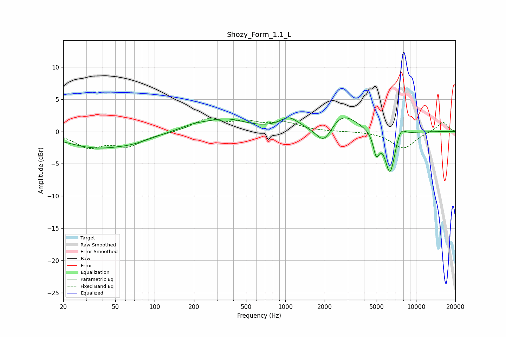

# Shozy_Form_1.1_L
See [usage instructions](https://github.com/jaakkopasanen/AutoEq#usage) for more options and info.

### Parametric EQs
Apply preamp of -2.2 dB when using parametric equalizer.

|   # | Type    |   Fc (Hz) |    Q |   Gain (dB) |
|-----|---------|-----------|------|-------------|
|   1 | Peaking |        35 | 0.61 |        -2.3 |
|   2 | Peaking |        69 | 1    |        -0.8 |
|   3 | Peaking |       201 | 1.25 |         0.7 |
|   4 | Peaking |       356 | 0.92 |         1.7 |
|   5 | Peaking |      1069 | 1.95 |         1.8 |
|   6 | Peaking |      1978 | 2.3  |        -3   |
|   7 | Peaking |      2720 | 1.24 |         3   |
|   8 | Peaking |      4963 | 6    |        -3.2 |
|   9 | Peaking |      6324 | 3.53 |        -6.7 |
|  10 | Peaking |      7632 | 3.95 |         1.6 |

### Fixed Band EQs
When using fixed band (also called graphic) equalizer, apply preamp of **-2.1 dB** (if available) and set gains manually with these parameters.

|   # | Type    |   Fc (Hz) |    Q |   Gain (dB) |
|-----|---------|-----------|------|-------------|
|   1 | Peaking |        31 | 1.41 |        -2.3 |
|   2 | Peaking |        62 | 1.41 |        -2.1 |
|   3 | Peaking |       125 | 1.41 |        -0.2 |
|   4 | Peaking |       250 | 1.41 |         1.8 |
|   5 | Peaking |       500 | 1.41 |         1.3 |
|   6 | Peaking |      1000 | 1.41 |         1.2 |
|   7 | Peaking |      2000 | 1.41 |         0   |
|   8 | Peaking |      4000 | 1.41 |         0   |
|   9 | Peaking |      8000 | 1.41 |        -2.6 |
|  10 | Peaking |     16000 | 1.41 |         1.5 |

### Graphs

