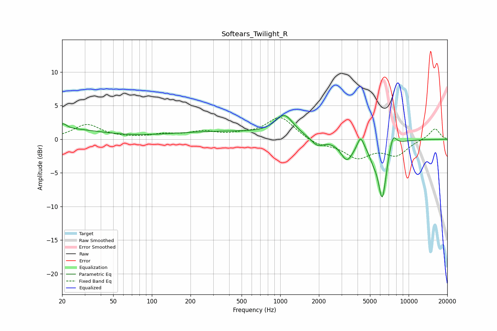

# Softears_Twilight_R
See [usage instructions](https://github.com/jaakkopasanen/AutoEq#usage) for more options and info.

### Parametric EQs
Apply preamp of -3.6 dB when using parametric equalizer.

|   # | Type    |   Fc (Hz) |    Q |   Gain (dB) |
|-----|---------|-----------|------|-------------|
|   1 | Peaking |        20 | 4.83 |         0.9 |
|   2 | Peaking |        23 | 0.57 |         1.4 |
|   3 | Peaking |       351 | 0.33 |         1.1 |
|   4 | Peaking |      1076 | 2.02 |         3.1 |
|   5 | Peaking |      1951 | 2.92 |        -1.3 |
|   6 | Peaking |      3308 | 2.89 |        -3   |
|   7 | Peaking |      4221 | 6    |         1.8 |
|   8 | Peaking |      5300 | 4.23 |        -1.5 |
|   9 | Peaking |      6230 | 4.23 |        -8.4 |
|  10 | Peaking |      7546 | 5.06 |         2.1 |

### Fixed Band EQs
When using fixed band (also called graphic) equalizer, apply preamp of **-3.3 dB** (if available) and set gains manually with these parameters.

|   # | Type    |   Fc (Hz) |    Q |   Gain (dB) |
|-----|---------|-----------|------|-------------|
|   1 | Peaking |        31 | 1.41 |         2.2 |
|   2 | Peaking |        62 | 1.41 |         0.1 |
|   3 | Peaking |       125 | 1.41 |         0.6 |
|   4 | Peaking |       250 | 1.41 |         1   |
|   5 | Peaking |       500 | 1.41 |         0.5 |
|   6 | Peaking |      1000 | 1.41 |         3.3 |
|   7 | Peaking |      2000 | 1.41 |        -0.8 |
|   8 | Peaking |      4000 | 1.41 |        -2.6 |
|   9 | Peaking |      8000 | 1.41 |        -2.2 |
|  10 | Peaking |     16000 | 1.41 |         1.7 |

### Graphs

