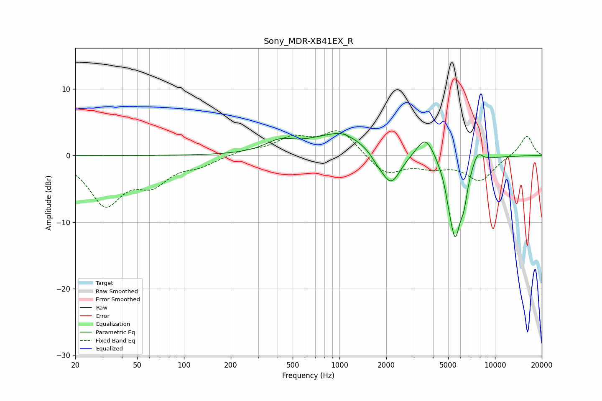

# Sony_MDR-XB41EX_R
See [usage instructions](https://github.com/jaakkopasanen/AutoEq#usage) for more options and info.

### Parametric EQs
Apply preamp of -3.4 dB when using parametric equalizer.

|   # | Type    |   Fc (Hz) |    Q |   Gain (dB) |
|-----|---------|-----------|------|-------------|
|   1 | Peaking |       412 | 1.53 |         1.5 |
|   2 | Peaking |      1012 | 0.73 |         3.3 |
|   3 | Peaking |      1033 | 2.87 |         0.3 |
|   4 | Peaking |      1739 | 3.5  |        -0.7 |
|   5 | Peaking |      2138 | 2.21 |        -5.1 |
|   6 | Peaking |      3582 | 2.42 |         3.6 |
|   7 | Peaking |      5067 | 6    |        -1.3 |
|   8 | Peaking |      5547 | 3.44 |       -11.6 |
|   9 | Peaking |      6312 | 6    |        -3.1 |
|  10 | Peaking |      7735 | 4.19 |         1.8 |

### Fixed Band EQs
When using fixed band (also called graphic) equalizer, apply preamp of **-3.8 dB** (if available) and set gains manually with these parameters.

|   # | Type    |   Fc (Hz) |    Q |   Gain (dB) |
|-----|---------|-----------|------|-------------|
|   1 | Peaking |        31 | 1.41 |        -7.1 |
|   2 | Peaking |        62 | 1.41 |        -3.6 |
|   3 | Peaking |       125 | 1.41 |        -1.2 |
|   4 | Peaking |       250 | 1.41 |         0.7 |
|   5 | Peaking |       500 | 1.41 |         2.4 |
|   6 | Peaking |      1000 | 1.41 |         3.8 |
|   7 | Peaking |      2000 | 1.41 |        -2.9 |
|   8 | Peaking |      4000 | 1.41 |        -1.4 |
|   9 | Peaking |      8000 | 1.41 |        -3.7 |
|  10 | Peaking |     16000 | 1.41 |         3.1 |

### Graphs

