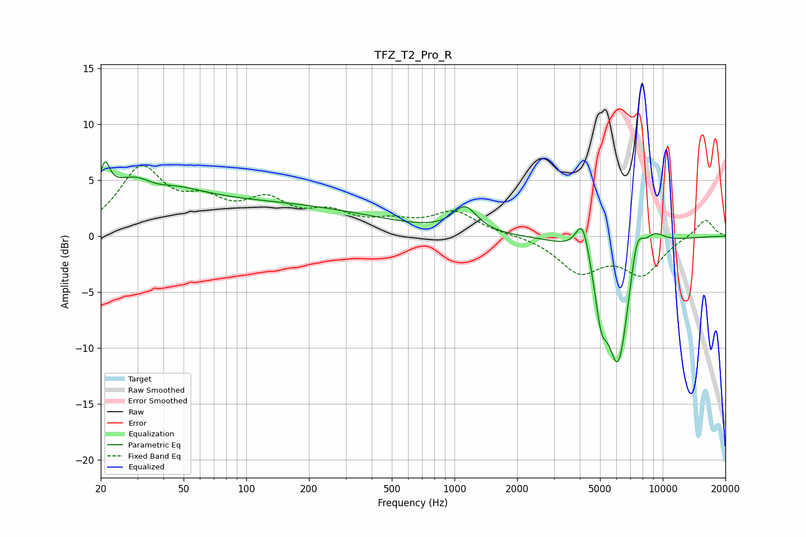

# TFZ_T2_Pro_R
See [usage instructions](https://github.com/jaakkopasanen/AutoEq#usage) for more options and info.

### Parametric EQs
Apply preamp of -6.7 dB when using parametric equalizer.

|   # | Type    |   Fc (Hz) |    Q |   Gain (dB) |
|-----|---------|-----------|------|-------------|
|   1 | Peaking |        21 | 5.96 |         2.9 |
|   2 | Peaking |        32 | 0.85 |         4.9 |
|   3 | Peaking |        36 | 1.6  |        -1.8 |
|   4 | Peaking |       117 | 0.25 |         2.8 |
|   5 | Peaking |      1123 | 2.48 |         2.3 |
|   6 | Peaking |      4124 | 4.22 |         3.5 |
|   7 | Peaking |      5062 | 4.86 |        -3.9 |
|   8 | Peaking |      6116 | 2.33 |       -11.8 |
|   9 | Peaking |      7496 | 3.98 |         3.8 |
|  10 | Peaking |      9051 | 2.31 |         1.5 |

### Fixed Band EQs
When using fixed band (also called graphic) equalizer, apply preamp of **-6.4 dB** (if available) and set gains manually with these parameters.

|   # | Type    |   Fc (Hz) |    Q |   Gain (dB) |
|-----|---------|-----------|------|-------------|
|   1 | Peaking |        31 | 1.41 |         5.8 |
|   2 | Peaking |        62 | 1.41 |         2.4 |
|   3 | Peaking |       125 | 1.41 |         2.7 |
|   4 | Peaking |       250 | 1.41 |         1.7 |
|   5 | Peaking |       500 | 1.41 |         1   |
|   6 | Peaking |      1000 | 1.41 |         2.1 |
|   7 | Peaking |      2000 | 1.41 |         0.1 |
|   8 | Peaking |      4000 | 1.41 |        -3.1 |
|   9 | Peaking |      8000 | 1.41 |        -3.2 |
|  10 | Peaking |     16000 | 1.41 |         1.6 |

### Graphs

