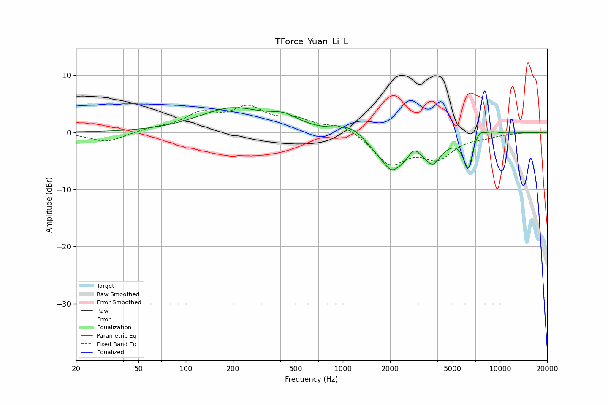

# TForce_Yuan_Li_L
See [usage instructions](https://github.com/jaakkopasanen/AutoEq#usage) for more options and info.

### Parametric EQs
Apply preamp of -4.4 dB when using parametric equalizer.

|   # | Type    |   Fc (Hz) |    Q |   Gain (dB) |
|-----|---------|-----------|------|-------------|
|   1 | Peaking |       196 | 0.67 |         4.1 |
|   2 | Peaking |       424 | 1.5  |         1.7 |
|   3 | Peaking |      1163 | 1.29 |         2.9 |
|   4 | Peaking |      2029 | 3.98 |        -1.1 |
|   5 | Peaking |      2122 | 0.89 |        -6.6 |
|   6 | Peaking |      2829 | 3.68 |         2.3 |
|   7 | Peaking |      3755 | 3.04 |        -3   |
|   8 | Peaking |      6257 | 4.94 |        -5.7 |
|   9 | Peaking |      7376 | 4.39 |         1.4 |
|  10 | Peaking |      8868 | 2.52 |         0.5 |

### Fixed Band EQs
When using fixed band (also called graphic) equalizer, apply preamp of **-4.9 dB** (if available) and set gains manually with these parameters.

|   # | Type    |   Fc (Hz) |    Q |   Gain (dB) |
|-----|---------|-----------|------|-------------|
|   1 | Peaking |        31 | 1.41 |        -1.7 |
|   2 | Peaking |        62 | 1.41 |         0.6 |
|   3 | Peaking |       125 | 1.41 |         2.9 |
|   4 | Peaking |       250 | 1.41 |         3.9 |
|   5 | Peaking |       500 | 1.41 |         1.9 |
|   6 | Peaking |      1000 | 1.41 |         1.5 |
|   7 | Peaking |      2000 | 1.41 |        -5.3 |
|   8 | Peaking |      4000 | 1.41 |        -4   |
|   9 | Peaking |      8000 | 1.41 |        -0.5 |
|  10 | Peaking |     16000 | 1.41 |         0.1 |

### Graphs

