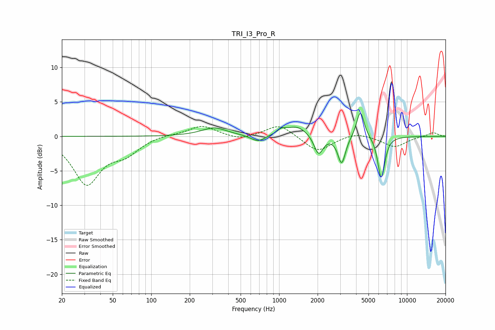

# TRI_I3_Pro_R
See [usage instructions](https://github.com/jaakkopasanen/AutoEq#usage) for more options and info.

### Parametric EQs
Apply preamp of -3.4 dB when using parametric equalizer.

|   # | Type    |   Fc (Hz) |    Q |   Gain (dB) |
|-----|---------|-----------|------|-------------|
|   1 | Peaking |       309 | 1.28 |         0.9 |
|   2 | Peaking |       313 | 2.07 |         0.3 |
|   3 | Peaking |       685 | 2.6  |        -1   |
|   4 | Peaking |      1047 | 4    |         0.7 |
|   5 | Peaking |      1384 | 1.76 |         1.5 |
|   6 | Peaking |      2034 | 4.12 |        -2.8 |
|   7 | Peaking |      3084 | 4.77 |        -4   |
|   8 | Peaking |      4316 | 4.83 |         4   |
|   9 | Peaking |      6248 | 5.3  |        -5.5 |
|  10 | Peaking |      6591 | 6    |        -0.9 |

### Fixed Band EQs
When using fixed band (also called graphic) equalizer, apply preamp of **-1.5 dB** (if available) and set gains manually with these parameters.

|   # | Type    |   Fc (Hz) |    Q |   Gain (dB) |
|-----|---------|-----------|------|-------------|
|   1 | Peaking |        31 | 1.41 |        -6.7 |
|   2 | Peaking |        62 | 1.41 |        -2.1 |
|   3 | Peaking |       125 | 1.41 |         0.3 |
|   4 | Peaking |       250 | 1.41 |         1.6 |
|   5 | Peaking |       500 | 1.41 |        -0.6 |
|   6 | Peaking |      1000 | 1.41 |         1.8 |
|   7 | Peaking |      2000 | 1.41 |        -2.3 |
|   8 | Peaking |      4000 | 1.41 |         0.7 |
|   9 | Peaking |      8000 | 1.41 |        -1.5 |
|  10 | Peaking |     16000 | 1.41 |         0.6 |

### Graphs

