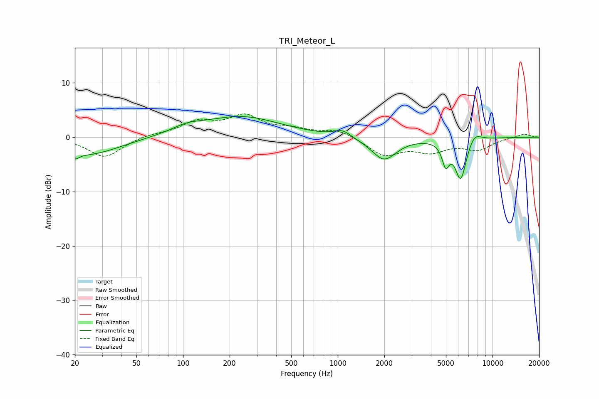

# TRI_Meteor_L
See [usage instructions](https://github.com/jaakkopasanen/AutoEq#usage) for more options and info.

### Parametric EQs
Apply preamp of -3.9 dB when using parametric equalizer.

|   # | Type    |   Fc (Hz) |    Q |   Gain (dB) |
|-----|---------|-----------|------|-------------|
|   1 | Peaking |        20 | 5.25 |        -1.1 |
|   2 | Peaking |        24 | 0.69 |        -3.2 |
|   3 | Peaking |       106 | 1.44 |         1.1 |
|   4 | Peaking |       173 | 0.74 |        -0.3 |
|   5 | Peaking |       230 | 0.55 |         4   |
|   6 | Peaking |      1072 | 2.65 |         1.3 |
|   7 | Peaking |      1990 | 1.75 |        -4.2 |
|   8 | Peaking |      4980 | 6    |        -3.9 |
|   9 | Peaking |      6230 | 3.69 |        -7.6 |
|  10 | Peaking |      7627 | 3.14 |         1.8 |

### Fixed Band EQs
When using fixed band (also called graphic) equalizer, apply preamp of **-4.4 dB** (if available) and set gains manually with these parameters.

|   # | Type    |   Fc (Hz) |    Q |   Gain (dB) |
|-----|---------|-----------|------|-------------|
|   1 | Peaking |        31 | 1.41 |        -3.7 |
|   2 | Peaking |        62 | 1.41 |         0.5 |
|   3 | Peaking |       125 | 1.41 |         2.6 |
|   4 | Peaking |       250 | 1.41 |         3.6 |
|   5 | Peaking |       500 | 1.41 |         1.2 |
|   6 | Peaking |      1000 | 1.41 |         1.4 |
|   7 | Peaking |      2000 | 1.41 |        -3.2 |
|   8 | Peaking |      4000 | 1.41 |        -2.3 |
|   9 | Peaking |      8000 | 1.41 |        -2.1 |
|  10 | Peaking |     16000 | 1.41 |         0.7 |

### Graphs

