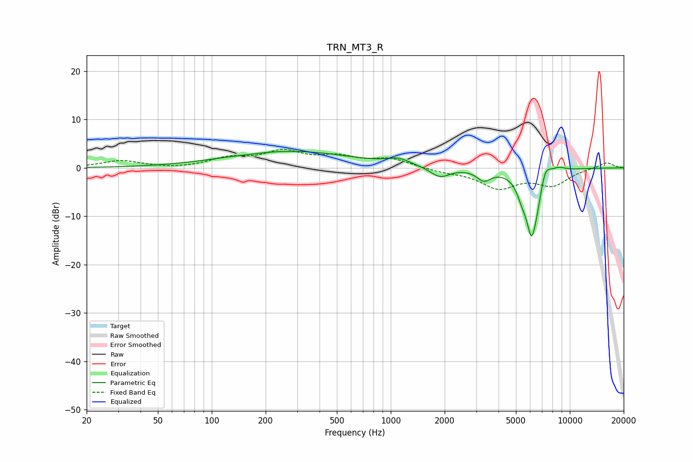

# TRN_MT3_R
See [usage instructions](https://github.com/jaakkopasanen/AutoEq#usage) for more options and info.

### Parametric EQs
Apply preamp of -3.5 dB when using parametric equalizer.

|   # | Type    |   Fc (Hz) |    Q |   Gain (dB) |
|-----|---------|-----------|------|-------------|
|   1 | Peaking |       168 | 1.95 |        -0.1 |
|   2 | Peaking |       272 | 0.4  |         3.4 |
|   3 | Peaking |      1105 | 2.27 |         1.2 |
|   4 | Peaking |      1883 | 2.61 |        -2.1 |
|   5 | Peaking |      3306 | 3.69 |        -2.2 |
|   6 | Peaking |      5386 | 5.35 |        -2.1 |
|   7 | Peaking |      6115 | 3.92 |       -13.3 |
|   8 | Peaking |      6585 | 6    |        -1.9 |
|   9 | Peaking |      7309 | 4.71 |         3.2 |
|  10 | Peaking |      8582 | 3.14 |         1   |

### Fixed Band EQs
When using fixed band (also called graphic) equalizer, apply preamp of **-3.9 dB** (if available) and set gains manually with these parameters.

|   # | Type    |   Fc (Hz) |    Q |   Gain (dB) |
|-----|---------|-----------|------|-------------|
|   1 | Peaking |        31 | 1.41 |         1.5 |
|   2 | Peaking |        62 | 1.41 |        -0.2 |
|   3 | Peaking |       125 | 1.41 |         1.8 |
|   4 | Peaking |       250 | 1.41 |         3.1 |
|   5 | Peaking |       500 | 1.41 |         2   |
|   6 | Peaking |      1000 | 1.41 |         1.8 |
|   7 | Peaking |      2000 | 1.41 |        -0.7 |
|   8 | Peaking |      4000 | 1.41 |        -4   |
|   9 | Peaking |      8000 | 1.41 |        -3.3 |
|  10 | Peaking |     16000 | 1.41 |         1.2 |

### Graphs

