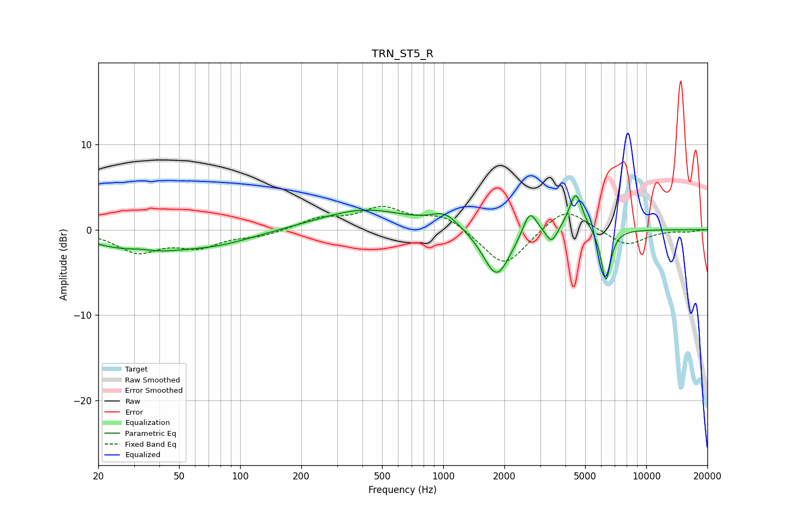

# TRN_ST5_R
See [usage instructions](https://github.com/jaakkopasanen/AutoEq#usage) for more options and info.

### Parametric EQs
Apply preamp of -4.0 dB when using parametric equalizer.

|   # | Type    |   Fc (Hz) |    Q |   Gain (dB) |
|-----|---------|-----------|------|-------------|
|   1 | Peaking |        32 | 2.24 |         0.4 |
|   2 | Peaking |        32 | 0.66 |        -2.4 |
|   3 | Peaking |        80 | 0.78 |        -1.2 |
|   4 | Peaking |       408 | 0.65 |         2.4 |
|   5 | Peaking |      1020 | 2.06 |         1.7 |
|   6 | Peaking |      1833 | 2.11 |        -5.7 |
|   7 | Peaking |      2671 | 4.14 |         3.1 |
|   8 | Peaking |      3417 | 5.21 |        -1.8 |
|   9 | Peaking |      4498 | 4.17 |         4.6 |
|  10 | Peaking |      6323 | 5.76 |        -6.2 |

### Fixed Band EQs
When using fixed band (also called graphic) equalizer, apply preamp of **-2.8 dB** (if available) and set gains manually with these parameters.

|   # | Type    |   Fc (Hz) |    Q |   Gain (dB) |
|-----|---------|-----------|------|-------------|
|   1 | Peaking |        31 | 1.41 |        -2.5 |
|   2 | Peaking |        62 | 1.41 |        -1.8 |
|   3 | Peaking |       125 | 1.41 |        -0.7 |
|   4 | Peaking |       250 | 1.41 |         1.2 |
|   5 | Peaking |       500 | 1.41 |         2.4 |
|   6 | Peaking |      1000 | 1.41 |         1.7 |
|   7 | Peaking |      2000 | 1.41 |        -4.5 |
|   8 | Peaking |      4000 | 1.41 |         2.8 |
|   9 | Peaking |      8000 | 1.41 |        -1.9 |
|  10 | Peaking |     16000 | 1.41 |        -0.2 |

### Graphs

